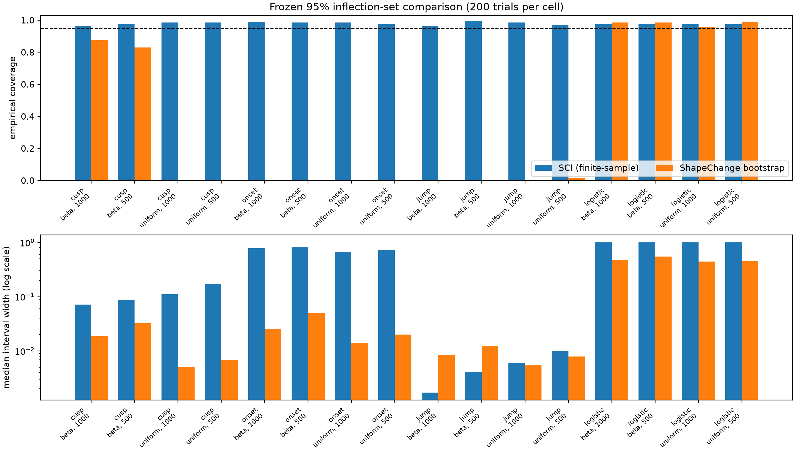
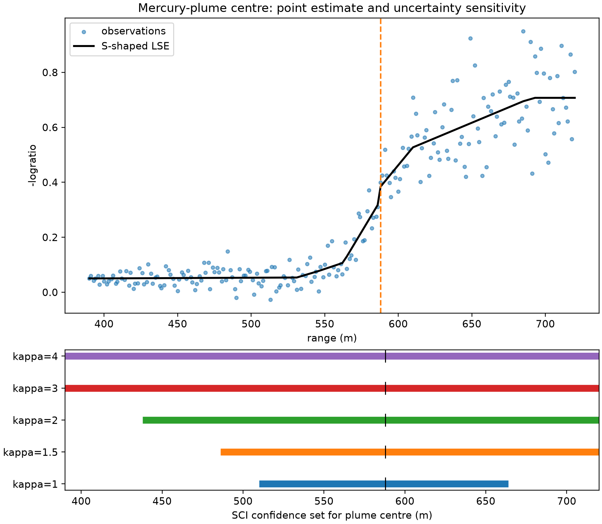
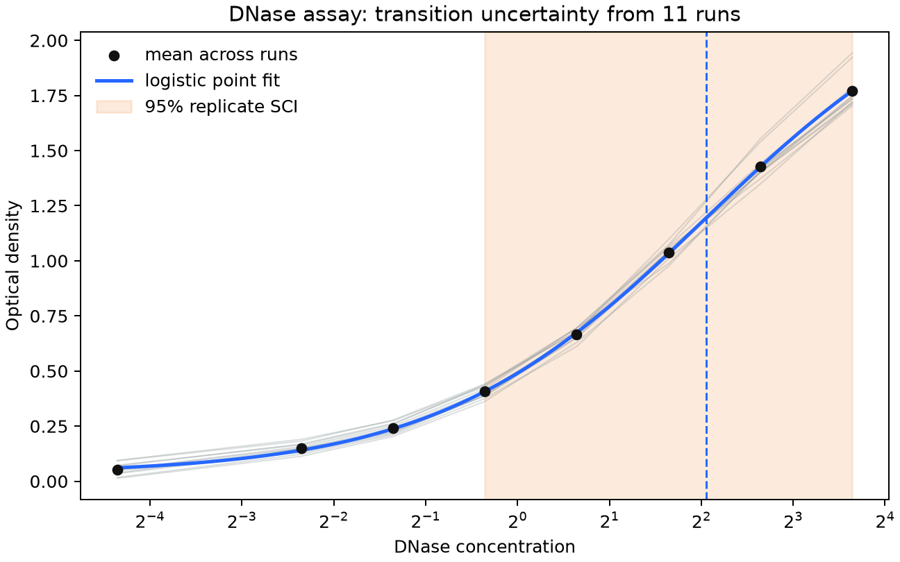
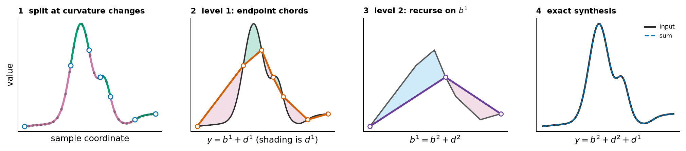
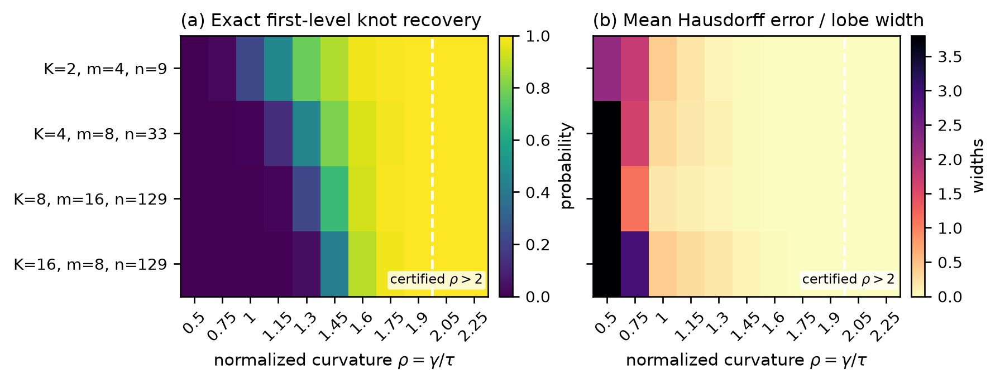
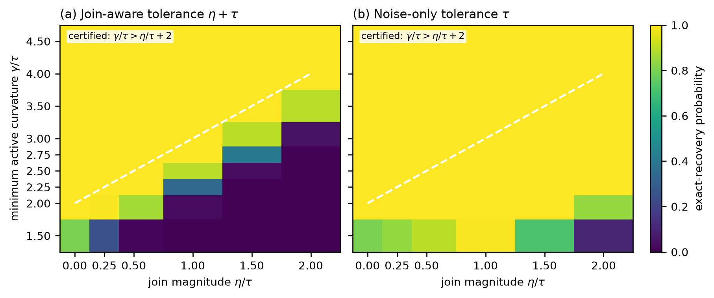
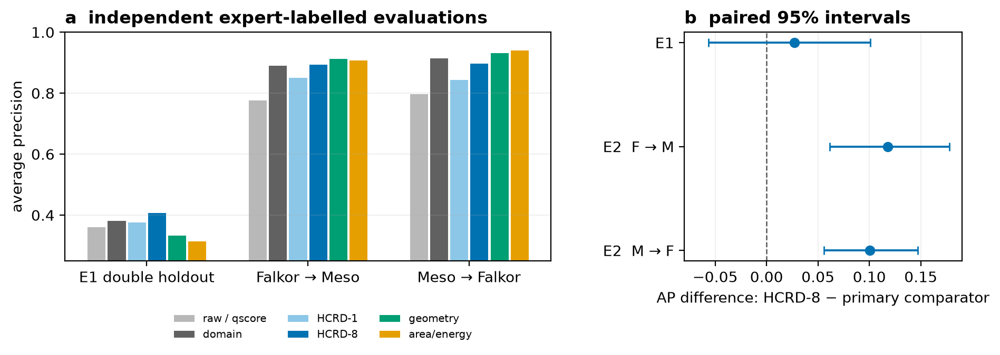

# Hierarchical Convexity-Run Decomposition (HCRD)

[](https://doi.org/10.5281/zenodo.22171976)

Reference implementation and reproducibility materials for *Hierarchical
Convexity-Run Decomposition of Sampled Curves: Finite-Sample Recovery and
Stability*.

**Saveliy Baturin**  
Independent Researcher

## Shape-Contrast Inversion: current publication track

The repository now includes the development artifact for **shape-contrast
inversion (SCI)**: a derivative-free finite-sample confidence set for the
location where an S-shaped regression curve changes from convex to concave.
SCI is designed as an honest uncertainty layer around a frontier point
estimator such as `Sshaped`; it is not presented as a generic point-estimation
booster.

The practical problem is trustworthy transition-location uncertainty when the
S-shape may contain a cusp, one-sided onset, affine region, or jump. Smooth
residual-bootstrap intervals can be narrow but badly undercover in these
regimes. Under the stated Gaussian assumptions, SCI covers the entire set of
admissible inflection locations without assuming derivatives, continuity at
the transition, or a unique transition.

The theorem package covers known noise scale, unknown constant noise, bounded
heteroskedasticity, and independent replicate curves. In the frozen E33
comparison, SCI coverage over the 16 published benchmark cells was
0.965--0.995, while `ShapeChange` had zero coverage in 9 cells. A new
high-precision audit used 5,000 fresh responses per cell. Coverage was
0.9770--0.9804 across all 16 cells. Its pre-specified zero-empty diagnostic
failed because SCI was empty in up to 2.28% of trials. This is below the 5%
theorem allowance, but the failed diagnostic remains visible. SCI can also
return a wide or full domain when the data contain too little curvature
information; this is a reported power boundary.

The matched E38r1 comparison adds an exact pointwise-band projection baseline
for the same sampled shape class. SCI reduced median width by 19.4%--75.7% for
the cusp, onset, and jump signals while both methods retained coverage. Neither
method localized the weak logistic signal. This baseline is our implementation
of generic confidence-region projection, not the official method of Davies et
al.



The real LIDAR illustration reports the plume-centre estimate together with a
variance-ratio sensitivity analysis rather than treating a narrow iid
bootstrap interval as automatically valid under heteroskedasticity.



The second real example uses 11 independent runs of the public DNase assay.
The exact replicate-curve version allows arbitrary dependence and unequal
variance between concentrations inside a run. It gives a 95% transition set
of `[0.78125, 12.5]` concentration units; a descriptive logistic fit gives a
point estimate of `4.14`. The wide upper side shows that the experiment does
not identify a reliable upper limit within the observed range.



The public implementation is now in the standalone `shapecontrast` namespace.
It does not create a dense contrast matrix. In the scaling audit, it evaluated
5,999,750 contrasts for one million observations in 0.73 seconds and stored
the family in 53.4 MiB on the benchmark machine. The equivalent dense matrix
would require about 44,702 GiB.

Start with [`docs/sci_artifact_inventory.md`](docs/sci_artifact_inventory.md),
the [publication blueprint](docs/hct_shape_inference_publication_blueprint_ru.md),
and [`examples/shapecontrast_quickstart.py`](examples/shapecontrast_quickstart.py).
Full commands and expected results are in
[`REPRODUCIBILITY.md`](REPRODUCIBILITY.md).

## Original HCRD release



HCRD partitions a sampled graph into maximal runs of one discrete-curvature
sign, replaces each run by its endpoint chord, stores the signed residual lobe,
and repeats on the retained knots. The hierarchy is finite, nested, exactly
reconstructing, and interpretable at every level.

## Features

- dense and sparse multilevel decompositions with exact reconstruction;
- support for uniformly and irregularly sampled signals;
- signed lobe support, amplitude, shape, area, and quadratic-energy summaries;
- deterministic process-parallel decomposition of independent signals;
- stable proximal and persistence-based companion representations;
- finite-sample recovery thresholds for exact and approximate sampled joins;
- calibrated finite-dictionary and continuous-family lobe scans;
- tests, experiment protocols, compact results, and source-data manifests.

## Theorem-linked recovery experiment

For alternating one-sign curvature blocks separated by isolated sampled
zero-curvature joins, the paper proves exact first-level boundary recovery when
the minimum active curvature satisfies `gamma > 2 tau`. The reproducible phase
diagram contains 44,000 Gaussian-noise draws across four event-count/width
configurations. All eight cells above the strict boundary had exact recovery
1.000; the smallest cellwise 95% Wilson lower bound was 0.9962.

```bash
python experiments/run_recovery_phase_diagram.py
python experiments/generate_recovery_phase_figure.py
```



The approximate-join corollary permits join curvature up to `eta` and proves
the same recovery and component bounds when `gamma > eta + 2 tau`. A second
phase experiment contains 162,000 unequal-amplitude signals. Both the
conservative `eta + tau` tolerance and the original noise-only `tau` tolerance
recovered all 72,000 draws in the strict certified region; the smallest
cellwise Wilson lower bound was 0.9962. The noise-only rule was more accurate
below that conservative boundary and does not require `eta` as an input.

```bash
python experiments/run_approximate_join_phase.py
python experiments/generate_approximate_join_phase_figure.py
```



## LC--MS application

The principal real-data application is quality curation of pre-bounded LC--MS
extracted-ion chromatograms. A single logistic pipeline was transferred between
two independently labelled HILIC studies without target refitting.

| Transfer | qscore AP | HCRD-1+Q AP | HCRD-8+Q AP | HCRD-8 - qscore (95% CI) |
|---|---:|---:|---:|---:|
| Falkor to MESOSCOPE | 0.7774 | 0.8516 | **0.8955** | +0.1181 [0.0613, 0.1781] |
| MESOSCOPE to Falkor | 0.7984 | 0.8446 | **0.8990** | +0.1005 [0.0559, 0.1470] |

The score is an independent global-window reimplementation of the published
two-component definition. The Holm-adjusted p-value was 0.00040 in both
directions. Four fixed qscore implementations changed the minimum-point and
across-file aggregation rules; HCRD-8 remained positive in all eight
direction/implementation contrasts (+0.0765 to +0.1517 AP), with every paired
95% interval above zero and maximum Holm-adjusted bootstrap value 0.0020.
In ten acquisition-file delete-group representation refits, the HCRD gain was
positive in every fold, ranging from +0.1030 to +0.1397 AP for Falkor to
MESOSCOPE and +0.0517 to +0.1058 in the reverse direction.
Source-refit RT-block bootstraps also had positive mean differences in both
directions at 30, 60, and 120 seconds (+0.0515 to +0.1087 AP; 80.7--96.3% of
paired replicates positive), although all six percentile intervals crossed
zero. With the saved source model held fixed, paired resampling of whole target
retention-time blocks gave positive 95% intervals in both directions at the
pre-specified 60-second width: +0.1181 `[0.0130, 0.2190]` and +0.1005
`[0.0338, 0.1965]`. Five of six fixed-model intervals were positive over the
30-, 60-, and 120-second sensitivity grid; only the coarsest Falkor-to-MESOSCOPE
interval crossed zero. The supported E2 estimand remains conditional on the
saved source fit rather than source-training uncertainty.
HCRD-8 also had positive AP differences over HCRD-1 in both transfers,
with multiplicity-adjusted support in one. An equal-dimensional 2847-variable
Gaussian-derivative control tied HCRD-8 in Falkor-to-MESOSCOPE; HCRD-8 exceeded
it by 0.1175 AP in the reverse transfer (95% CI [0.0624, 0.1654]). On the
conditionally labelled Pttime subset, HCRD-8+Q achieved residual-error AP
0.5085, compared
with 0.0391 for qscore and 0.2845 for HCRD-1+Q. At 1%, 5%, and 10% review
budgets it retrieved 4, 7, and 8 of 17 bad cases, versus 0, 0, and 1 for
qscore. On the independent TARDIS/FAME
shift, HCRD-8+Q improved AP by 0.0725 in point estimate, while the confidence
interval crossed zero and a compact conventional feature bank was point-best.
These results identify pre-bounded compact-lobe curation as the supported
application setting and show that hierarchy depth can depend on acquisition
conditions.



## Installation

Python 3.11 or later is recommended.

```bash
python -m pip install -e ".[dev,comparisons,lcms]"
python -m pytest -q
python examples/quickstart.py
```

Optional dependency groups are available for LC--MS, PPG, anomaly-detection,
classification, RUL, and comparator experiments; see `pyproject.toml`.

## Quick start

```python
import numpy as np
from hcrd import decompose, decompose_sparse, level_energies

x = np.linspace(0.0, 1.0, 256)
y = np.sin(2 * np.pi * x) + 0.25 * np.exp(-((x - 0.6) / 0.08) ** 2)

dense = decompose(y, x)
np.testing.assert_allclose(dense.reconstruct(), y, atol=1e-12)

sparse = decompose_sparse(y, x)
print(sparse.knot_sets)
print(level_energies(sparse))
```

Independent signals can be processed in deterministic order:

```python
from hcrd import decompose_sparse_batch

hierarchies = decompose_sparse_batch(signals, backend="process", workers=4)
```

## Reproducing the main LC--MS experiment

```bash
python -m pip install -e ".[dev,lcms]"
python experiments/download_ms_metrics_e2.py
python experiments/run_ms_metrics_e2.py extract-dataset --help
python experiments/run_ms_metrics_e2.py fit-evaluate --help
python experiments/run_ms_metrics_e2_matched_capacity.py --help
python experiments/run_ms_metrics_e2_refit_sensitivity.py --help
python experiments/run_ms_metrics_e2_fixed_source_block.py --help
python experiments/run_ms_metrics_e2_file_group_sensitivity.py --help
python experiments/run_qscore_implementation_sensitivity.py --help
```

The downloader verifies the official archives and pinned source revision. Raw
mzML files and multi-gigabyte intermediate arrays are rebuilt locally and are
not redistributed. Frozen labels, compact model outputs, bootstrap statistics,
and hashes are included under `data/manifests/`, `results/ms_metrics_e2/`, and
`reports/ms_metrics_e2.md`.

Commands for all other experiments are listed in
[`REPRODUCIBILITY.md`](REPRODUCIBILITY.md).

## Repository structure

| Path | Contents |
|---|---|
| `src/hcrd/` | Transform, sparse hierarchy, feature extraction, and scans |
| `src/shapecontrast/` | Matrix-free SCI and finite-sample uncertainty bands |
| `tests/` | Unit, regression, and mathematical-property tests |
| `experiments/` | Data preparation and experiment entry points |
| `docs/` | Dataset-specific protocols and methodological notes |
| `theory/` | Proof structures and mathematical supplements |
| `results/` | Compact numerical outputs |
| `reports/` | Experiment summaries |
| `paper/` | LaTeX source, figures, and compiled preprint |
| `data/manifests/` | Source URLs, checksums, and dataset partitions |

The integrity manifest can be checked with:

```bash
python scripts/verify_release.py
```

## Paper and citation

The SCI files on `main` are a development publication artifact and do not yet
have a paper DOI. The citation metadata and Zenodo DOI below identify the
earlier HCRD v0.1.0 archive; they should not be cited as if they already
archived the SCI claims.

The compiled main manuscript is
[`paper/hcrd_preprint.pdf`](paper/hcrd_preprint.pdf); detailed proofs, optional
scan theory, and secondary experiments are in
[`paper/hcrd_supplement.pdf`](paper/hcrd_supplement.pdf). Citation metadata are
provided in [`CITATION.cff`](CITATION.cff). The venue-formatted manuscript,
cover letter, and build instructions for SIMODS are under
[`paper/simods/`](paper/simods/). Release `v0.1.0` is archived on Zenodo at
[doi:10.5281/zenodo.22171977](https://doi.org/10.5281/zenodo.22171977). A
compile-tested arXiv upload archive with POSIX-only internal paths can be built
with `python paper/build_arxiv_source.py`.

## Data and licenses

Third-party datasets and comparator repositories are not redistributed.
Download scripts, source URLs, archive hashes, protocols, and compact outputs
are included where licensing permits.

Code is licensed under the MIT License (`LICENSE`). The manuscript,
documentation, protocols, original figures, and original result files are
licensed under CC BY 4.0 (`LICENSE-CONTENT.md`). Third-party materials retain
their original terms.
