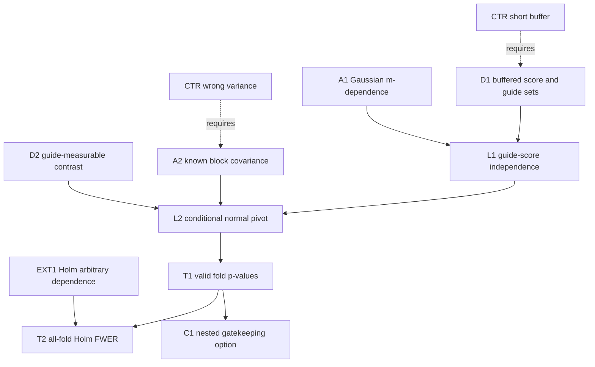

# Buffered cross-fit inference for dependent streams

**Need.** Replace the requirement for a physically separate guide replicate by
an exact single-stream construction under an explicitly stated temporal
dependence model.

## Normalized statement

Let $Y_t=f_t+e_t$, $t=1,\ldots,n$. Assume $(e_t)$ is a mean-zero Gaussian
$m$-dependent process with known scoring-block covariance matrices: index sets
separated by more than $m$ are independent. For fold $k$, let $B_k$ be a
contiguous scoring block and let the guide sigma-field $\mathcal G_k$ use only
indices at distance greater than $m$ from $B_k$. Let a finite collection of
contrasts $c_{ks}$ supported on $B_k$ be $\mathcal G_k$-measurable. Under

$$
H_{ks}:c_{ks}^Tf_{B_k}=0,
$$

define

$$
Z_{ks}={c_{ks}^TY_{B_k}\over
\sqrt{c_{ks}^T\Sigma_{B_k}c_{ks}}}.
$$

Conditionally on $\mathcal G_k$, every true-null $Z_{ks}$ is standard normal.
Therefore its two-sided p-value is marginally valid after guide-side HCRD
selection. Holm over all folds/structures controls FWER under arbitrary
cross-fold dependence. If the hypotheses are subtree intersection nulls, the
nested gatekeeping theorem may replace Holm.

Every index can be scored once by partitioning the stream into blocks; only the
$m$ indices adjacent to a block are omitted from that fold's guide, not from
their own scoring folds. The implementation exposes these sets via
`buffered_crossfit_folds` and the known-covariance pivot via
`gaussian_contrast_pivot`.

## Node table

| ID | Type | Content |
|---|---|---|
| D1 | DEF | scoring blocks and distance-$m$ guide buffers |
| A1 | ASM | Gaussian $m$-dependent noise |
| A2 | ASM | known positive scoring-block covariance |
| D2 | DEF | guide-measurable HCRD contrasts supported on scoring block |
| D3 | DEF | contrast null and standardised pivot |
| L1 | LEM | $e_{B_k}$ is independent of $\mathcal G_k$ |
| L2 | LEM | conditional $N(0,1)$ law for each true-null pivot |
| T1 | THM | valid post-guide p-values for one fold |
| EXT1 | EXT | Holm controls FWER for valid marginals under arbitrary dependence |
| T2 | THM | all-fold strong FWER control |
| C1 | COR | nested tree gatekeeping can replace Holm for subtree nulls |
| CTR1 | CTR | buffer shorter than $m$ permits guide-score dependence |
| CTR2 | CTR | diagonal variance under correlated block noise misstandardises the pivot |
| CTR3 | CTR | data-estimated covariance/lag needs another theorem |

## Edge table

| From | Relation | To |
|---|---|---|
| D1, A1 | gives | L1 |
| L1, A2, D2, D3 | gives | L2 |
| L2 | implies | T1 |
| T1, EXT1 | implies | T2 |
| T1, nested-null theorem | implies | C1 |
| CTR1 | fails_without | D1/A1 |
| CTR2 | fails_without | A2 |
| CTR3 | requires | new covariance/lag-estimation analysis |

## Mermaid DAG

## First use of hypotheses

- The lag $m$ and buffer geometry are first used to make scoring noise
  independent of the fold guide.
- Gaussianity and known full block covariance are first used in the exact
  contrast law.
- Guide measurability is first used when conditioning; scoring samples cannot
  modify the contrast.
- No independence between fold p-values is used by Holm or the nested theorem.

## Compressed proof skeleton

1. Distance-$m$ separation and $m$-dependence make $e_{B_k}$ independent of
   the guide sigma-field.
2. Conditional on the guide, each contrast is fixed; under its null the
   numerator is centred Gaussian with variance $c^T\Sigma c$.
3. Standardisation gives a conditionally and marginally valid two-sided
   p-value.
4. Collect all fold p-values and apply Holm under arbitrary dependence, or
   apply nested gatekeeping when the null logic is a subtree intersection.

## Adversarial batch review

**First failure.** “Temporally dependent” alone is not enough to make a finite
buffer exact.

**Repair.** The theorem states Gaussian $m$-dependence. Mixing processes need
an explicit coupling/error term and are not silently included.

**Next failure.** Independence of scoring and guide does not make samples
inside the scoring block independent.

**Repair.** The full known block covariance $\Sigma_{B_k}$ appears in the
denominator.

**Next failure.** Reusing every index across different guide sets creates
cross-fold dependence.

**Repair.** Holm and the nested procedure require valid marginals, not
independent fold p-values.

**Next risk.** Choosing $m$, $\Sigma$, or the HCRD tolerance from the scoring
fold invalidates exactness. These quantities must be fixed or learned outside
that fold.

## Counterexamples

**CTR1 — AR(1) with finite buffer.** A Gaussian AR(1) is mixing but not
$m$-dependent for any finite $m$; guide and score remain correlated. The exact
theorem does not apply.

**CTR2 — ignored block covariance.** For positively correlated samples, using
$\sigma^2\|c\|^2$ instead of $c^T\Sigma c$ can understate or overstate variance
depending on the contrast signs.

## Open extensions

The exact finite-memory single-stream analogue is closed. Still `OPEN` are
finite-sample covariance estimation, data-driven lag selection, and explicit
$\beta$-mixing coupling corrections for infinite-memory streams.

**Internal-node retrieval prompt.** Explain why each fold pivot is valid after
guide selection even though the collection of pivots across folds can be
strongly dependent.
