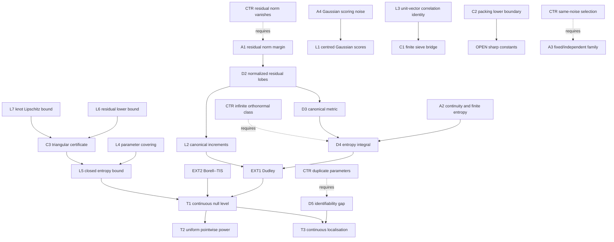

# Continuous HCRD lobe-class scan: entropy, power, and localisation

**Need.** Replace the finite-template alternative by an uncountable
location--scale--asymmetry family without pretending that a numerical grid is
the continuum or that a same-replicate HCRD-selected family is fixed.

## Normalized statement

Let $x\in\mathbb R^n$ be fixed and let $P$ be orthogonal projection onto
$\operatorname{span}\{1,x\}$. Let $(\Theta,d_\Theta)$ be compact and let raw
lobes $w_\theta\in\mathbb R^n$ satisfy

$$
\inf_{\theta\in\Theta}\|(I-P)w_\theta\|_2>0.
$$

Define the oriented normalized residual template

$$
v_\theta={ (I-P)w_\theta\over\|(I-P)w_\theta\|_2},
\qquad
d(\theta,\vartheta)=\|v_\theta-v_\vartheta\|_2.
$$

Assume $\theta\mapsto v_\theta$ is continuous. Let
$N(\epsilon)=N(\Theta,d,\epsilon)$ and

$$
J(\Theta)=\int_0^2\sqrt{\log N(\epsilon)}\,d\epsilon<\infty.
$$

For $Y=g+\epsilon$, $g\in\operatorname{range}(P)$ and
$\epsilon\sim N(0,\sigma^2I)$, define

$$
S(Y)=\sup_{\theta\in\Theta}{\langle v_\theta,Y\rangle\over\sigma}.
$$

Using the explicit safe Dudley constant $24$, set

$$
t_\alpha=24J(\Theta)+\sqrt{2\log(1/\alpha)}.
$$

Then:

1. **Continuous null control.** $\Pr_0\{S(Y)>t_\alpha\}\le\alpha$.
2. **Uniform pointwise power.** Under
   $Y=g+\sigma\mu v_{\theta_0}+\epsilon$, the miss probability is at most
   $\beta$ whenever
   $$
   \mu\ge t_\alpha+\sqrt{2\log(1/\beta)}.
   $$
3. **Continuous localisation.** Define
   $$
   \Delta_{\theta_0}(r)=
   \inf_{d_\Theta(\theta,\theta_0)\ge r}
   \{1-\langle v_\theta,v_{\theta_0}\rangle\}.
   $$
   Let $J_\pm$ be any valid entropy-integral upper bound for the signed class
   $\{\pm v_\theta\}$. If $\Delta_{\theta_0}(r)>0$ and
   $$
   \mu\Delta_{\theta_0}(r)>
   2\left\{24J_\pm+\sqrt{2\log(1/\delta)}\right\},
   $$
   every measurable maximiser $\widehat\theta$ satisfies
   $d_\Theta(\widehat\theta,\theta_0)<r$ with probability at least
   $1-\delta$.
4. **Sieve bridge.** If a finite set $G_\eta\subset\Theta$ is an $\eta$-net
   in the canonical metric $d$, scanning its $M$ templates at the finite
   threshold $\sqrt{2\log(M/\alpha)}$ has level at most $\alpha$ over the
   complete continuous null. For every continuous alternative, a nearest net
   template has correlation at least $1-\eta^2/2$; hence miss probability is
   at most $\beta$ when
   $$
   \mu\ge
   {\sqrt{2\log(M/\alpha)}+\sqrt{2\log(1/\beta)}
    \over 1-\eta^2/2},\qquad \eta<\sqrt2.
   $$
5. **Parameter-box entropy certificate.** If
   $\Theta=\prod_{j=1}^d[a_j,b_j]$ and
   $\|v_\theta-v_\vartheta\|_2\le L\|\theta-\vartheta\|_2$, coordinate nets
   give
   $$
   N(\epsilon)\le
   \prod_{j=1}^d\left(1+{L\sqrt d\,(b_j-a_j)\over\epsilon}\right).
   $$
   If the actual canonical diameter is at most a certified
   $D\le\min\{2,L\|(b-a)\|_2\}$, then
   $$
   J(\Theta)\le D\left[
   \sqrt{\sum_{j=1}^d\log\left(1+{L\sqrt d\,(b_j-a_j)\over D}\right)}
   +{\sqrt{\pi d}\over2}\right].
   $$
6. **Packing lower boundary.** For any finite subfamily
   $v_1,\ldots,v_K$ with $\langle v_j,v_k\rangle\le\rho$ for $j\ne k$, the
   uniform alternative mixture satisfies
   $$
   \chi^2(\overline P,P_0)
   \le {e^{\mu^2}\over K}
      +\left(1-{1\over K}\right)e^{\rho\mu^2}-1.
   $$
   Thus a weakly correlated packing transfers the earlier chi-squared minimax
   obstruction to a continuous family. Sudakov minoration also makes the
   entropy scale unavoidable for the expected null supremum, up to universal
   constants. Neither statement implies sharp constants for every HCRD family.
7. **Concrete triangular-family certificate.** Let
   $x_1<\cdots<x_n$, $\Delta=\max_i(x_{i+1}-x_i)$, and let the raw lobe be
   the unit-height triangle parameterised by centre $c$, width $s$, and apex
   fraction $a$. On the box
   $$
   c\in[c_-,c_+],\quad s\in[s_-,s_+],\quad a\in[a_-,a_+]\subset(0,1),
   $$
   assume every support is strictly inside $(x_1,x_n)$. Put
   $$
   h=s_-\min\{a_-,1-a_+\},\qquad
   \gamma=1-{\Delta\over2h}>0,
   $$
   $$
   B=\sqrt{3.5+\max\{|a_--1/2|,|a_+-1/2|\}^2+s_+^2}.
   $$
   Then
   $$
   \inf_{\theta\in\Theta}\|(I-P)w_\theta\|_2\ge{\gamma\over\sqrt2},
   \qquad
   \|v_\theta-v_\vartheta\|_2
   \le {4\sqrt n\,B\over h\gamma}\|\theta-\vartheta\|_2.
   $$
   Thus item 5 supplies a fully analytic entropy certificate for this
   declared interior location--width--asymmetry family.

The family and any Lipschitz/entropy certificate must be fixed by the protocol
or an independent guide. The scoring noise cannot select the templates and
then reuse the displayed null law.

## Node table

| ID | Type | Content |
|---|---|---|
| D1 | DEF | Compact parameter space $(\Theta,d_\Theta)$ |
| D2 | DEF | Affine projection $P$ and normalized residual template $v_\theta$ |
| D3 | DEF | Canonical metric $d(\theta,\vartheta)=\|v_\theta-v_\vartheta\|_2$ |
| D4 | DEF | Covering number $N(\epsilon)$ and entropy integral $J(\Theta)$ |
| D5 | DEF | Identifiability modulus $\Delta_{\theta_0}(r)$ |
| A1 | ASM | Raw residual norm is uniformly positive |
| A2 | ASM | Template map is continuous and $J(\Theta)<\infty$ |
| A3 | ASM | Family/certificate fixed or independent of scoring noise |
| A4 | ASM | Known positive $\sigma$ and iid Gaussian scoring noise |
| EXT1 | EXT | Dudley entropy-integral expected-supremum inequality |
| EXT2 | EXT | Borell--TIS concentration around the expected supremum |
| L1 | LEM | Affine residualisation makes every null score centred Gaussian |
| L2 | LEM | Unit templates give canonical increments and variance one |
| L3 | LEM | $\langle u,v\rangle=1-\|u-v\|_2^2/2$ for unit vectors |
| L4 | LEM | Parameter grid covering bound for an $L$-Lipschitz map |
| L5 | LEM | Closed-form integral majorant for the parameter box |
| L6 | LEM | Near-apex sample plus endpoint affine contrast lower-bounds the residual norm |
| L7 | LEM | Bounded knot derivatives and the parameter-to-knot Jacobian give $L_\triangle$ |
| T1 | THM | Entropy-calibrated continuous null control |
| T2 | THM | Continuous-family power bound |
| T3 | THM | Identifiability-dependent continuous localisation |
| C1 | COR | Finite sieve has explicit continuum approximation loss |
| C2 | COR | Weak-correlation packing gives a minimax detection obstruction |
| C3 | COR | Interior triangular family has an explicit residual/Lipschitz entropy certificate |
| CTR1 | CTR | Vanishing residual norm makes $v_\theta$ undefined/discontinuous |
| CTR2 | CTR | Duplicate templates at separated parameters destroy localisation |
| CTR3 | CTR | Same-noise template selection invalidates fixed-family calibration |
| CTR4 | CTR | Infinite orthonormal Gaussian-sequence class has unbounded supremum |
| OPEN1 | RESOLVED-RESTRICTED | Safe analytic certificate for the interior triangular family; sharp constants and boundary-touching/general polygonal lobes remain open |
| OPEN2 | OPEN | Sharp generic-chaining rather than Dudley constants |
| OPEN3 | OPEN | Continuous-class theorem under estimated/dependent noise |

## Edge table

| From | Relation | To |
|---|---|---|
| D2, A1 | defines continuously | D3 |
| A4, D2 | gives | L1 |
| D2 | gives unit variance and increments | L2 |
| D3, D4, EXT1 | bounds expected supremum in | T1 |
| T1, EXT2 | gives tail level in | T1 |
| T1, score at $\theta_0$ | implies | T2 |
| D5, signed T1 | implies | T3 |
| L3, finite union bound | implies | C1 |
| L4, L5 | gives explicit certificate for | T1 |
| L6, L7 | give concrete triangular certificate | C3 |
| C3, L4, L5 | instantiate | T1 |
| finite packing likelihood ratio | implies | C2 |
| CTR1 | fails_without | A1 |
| CTR2 | fails_without | positive D5 |
| CTR3 | fails_without | A3 |
| CTR4 | fails_without | finite D4 in the Gaussian-sequence extension |

## Mermaid DAG

## First use of hypotheses

- The residual-norm margin is first used when dividing by
  $\|(I-P)w_\theta\|_2$ and proving continuity of $v_\theta$.
- Compactness and continuity are first used to obtain a separable bounded
  Gaussian process and existence of a maximiser. For a finite numerical sieve,
  neither is hidden: the maximum is over explicit rows.
- Gaussianity and known $\sigma$ are first used in Dudley--Borell calibration.
  Studentisation by a random scale needs another theorem.
- The identifiability modulus is first used to separate the mean score at the
  true parameter from all parameters outside radius $r$.
- Fixed/independent family selection is first used before asserting the null
  process covariance. A same-replicate HCRD tree is random and correlated with
  its score.

## Compressed proof skeleton

1. Affine projection removes $g$, so
   $Z_\theta=\langle v_\theta,\epsilon\rangle/\sigma$ is centred Gaussian with
   variance one and canonical metric $d$.
2. Dudley's inequality gives
   $\mathbb E\sup_\theta Z_\theta\le24J(\Theta)$; Borell--TIS adds the
   $\sqrt{2\log(1/\alpha)}$ tail, proving T1.
3. Under the alternative, the score at the included true template is
   $N(\mu,1)$, which proves T2 by a Gaussian lower-tail bound.
4. On the signed-process envelope event, the true score is at least $\mu-u$;
   every parameter outside $r$ scores at most
   $\mu(1-\Delta_{\theta_0}(r))+u$. The displayed gap proves T3.
5. For an $\eta$-net, the unit-vector identity gives nearest-template
   correlation at least $1-\eta^2/2$; the finite union bound proves C1.
6. A coordinate grid covers the parameter box. Integrate the logarithmic
   covering bound using $\sqrt{a+b}\le\sqrt a+\sqrt b$ and
   $\int_0^1\sqrt{\log(1/u)}du=\sqrt\pi/2$.
7. Average the Gaussian likelihood ratios over a finite packing and evaluate
   their pairwise second moments to obtain C2.
8. For the triangular box, a grid point lies within $\Delta/2$ of every apex,
   so its lobe height is at least $\gamma$. Contrast this sample with the two
   zero endpoint samples using a vector orthogonal to both $1$ and $x$; its
   norm is at most $\sqrt2$, proving L6. On either linear branch, the gradient
   with respect to left/apex/right knots has norm at most $\sqrt2/h$.
   Multiplying by the Frobenius bound $B$ for the parameter-to-knot Jacobian,
   summing over $n$ samples, projecting nonexpansively, and applying the
   $2/m$ normalization inequality proves L7 and C3.

## Explicit counterexamples

**CTR1 — disappearing residual (`CTR`).** Let
$w_t=1+tx+ t^2q$ with $q\perp\operatorname{span}\{1,x\}$. At $t=0$ the
residual is zero; for $t\ne0$ its normalized orientation is $q/\|q\|$ for
$t>0$ and can be reversed by replacing $t^2$ with $t|t|$. The normalized map
has no theorem at the affine parameter. The minimal repair is A1.

**CTR2 — duplicated shape (`CTR`).** Take two distinct parameters
$\theta_0,\theta_1$ with $v_{\theta_0}=v_{\theta_1}$. Detection is unchanged,
but no statistic can identify which parameter generated the common
distribution. Here $\Delta_{\theta_0}(r)=0$ for any radius separating them.

**CTR3 — scoring-noise selection (`CTR`).** From a rich same-replicate class,
select the row most aligned with the observed residual and then test it as if
it had been fixed. The reported coordinate is the class supremum, not one
standard normal. A fixed-coordinate critical value is anti-conservative. The
repair is to calibrate the whole fixed class or split guide and score samples.

**CTR4 — missing entropy (`CTR`, Gaussian-sequence extension).** For an
infinite orthonormal family $(v_j)$ in an isonormal Gaussian experiment,
$Z_j$ are iid standard normals and $\sup_jZ_j=\infty$ almost surely. No finite
level threshold exists. In fixed finite $\mathbb R^n$, compact unit-sphere
geometry prevents this exact example, but the entropy controls how thresholds
grow with $n$ and resolution.

## Limits and open extensions

The uncountable statistical class is closed at the abstract metric-entropy
level, the finite sieve has a rigorous continuum approximation factor, and the
strictly interior triangular location--width--asymmetry family now has a fully
analytic residual/Lipschitz certificate implemented in
`triangular_lobe_lipschitz_certificate`. The constant is intentionally safe,
not sharp. Boundary-touching supports, general polygonal HCRD lobes, sharper
generic-chaining constants, and estimated or dependent noise remain OPEN.

**Internal-node retrieval prompt.** Recover the path from the affine
projection and unit normalization to the canonical metric; then explain how
that node feeds both the Dudley null bound and the $1-\eta^2/2$ sieve power
factor.

## Rank-aware sharpening

The separate DAG `rank_aware_continuous_scan_proof_dag.md` gives a second,
entropy-free calibration. Every unit residual template lies in the deterministic
affine-residual subspace, so the continuous supremum is bounded by a projected
Gaussian norm with an exact chi-square law. This reduces the 129-sample
80%-power sufficient norm from 285.1103 (safe Dudley certificate) to 13.2634
with the exact projected-norm quantile, or 13.9566 using the closed-form
Laurent--Massart threshold. The original entropy theorem is retained because it
can be sharper for genuinely low-complexity classes and supplies covering-based
approximation/local geometry; the rank theorem closes the practical constant
gap without replacing the continuum by the 595-template sieve.
