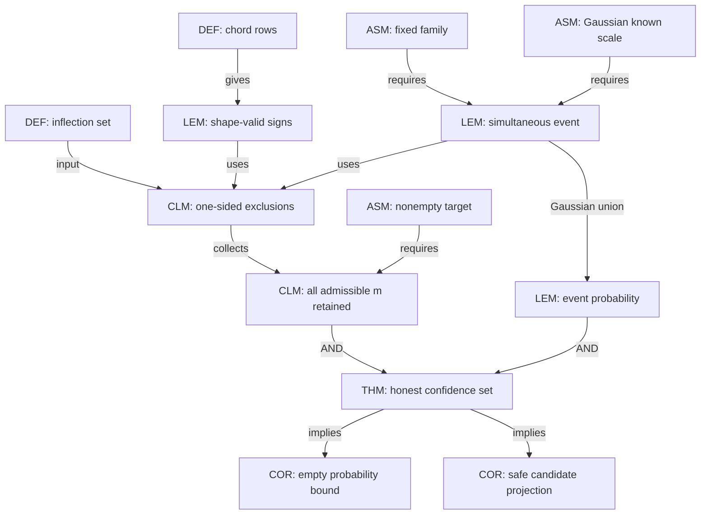

# Shape-contrast confidence sets for an S-shaped inflection

## Driving question

Can one obtain finite-sample uncertainty quantification for an S-shaped
inflection without estimating a derivative and without assuming smoothness at
the inflection?

## Definitions

Let `A < x_1 < ... < x_n < B` be fixed.  For `x_L < x_M < x_R`, define the
chord residual

$$
Q_{L,M,R}(f)
=
\frac{x_R-x_M}{x_R-x_L}f(x_L)
+\frac{x_M-x_L}{x_R-x_L}f(x_R)-f(x_M).
$$

For a finite family `T`, each row `w_T` is a nonnegative average of such chord
residual coefficient vectors.  Write `a_T` and `b_T` for the smallest and
largest design locations used by the row, and `mu_T = w_T^T f(x)`.

The admissible inflection set is

$$
I_f=\{m\in[A,B]: f\text{ is convex on }[A,m]
\text{ and concave on }[m,B]\}.
$$

Monotonicity is part of the Feng et al. S-shaped class but is not needed for
the theorem below.

## Normalized finite-sample theorem

**THM E33.1.**  Suppose `Y_i=f(x_i)+epsilon_i`, where the errors are
independent `N(0,sigma^2)` and `sigma` is known.  Let `T` be any finite family
of averaged chord residuals fixed before observing `Y`, and let `M=|T|`.
For

$$
c=\Phi^{-1}\!\left(1-\frac{\alpha}{2M}\right),\qquad
[L_T,U_T]=[w_T^TY-c\sigma\|w_T\|_2,
w_T^TY+c\sigma\|w_T\|_2],
$$

define

$$
\widehat L=\max\bigl(\{A\}\cup
\{a_T:L_T>0\}\bigr),\qquad
\widehat U=\min\bigl(\{B\}\cup
\{b_T:U_T<0\}\bigr),
$$

and `C(Y)=[L_hat,U_hat]`, interpreted as empty if `L_hat>U_hat`.
Then, uniformly over every `f` with nonempty `I_f`,

$$
\Pr_f\{I_f\subseteq C(Y)\}\ge 1-\alpha.
$$

Consequently, if `f` has a unique inflection `m_0`, `C(Y)` is an honest
`1-alpha` confidence set for `m_0`, and
`Pr_f{C(Y)=empty} <= alpha`.

The same conclusion holds for a jointly calibrated Gaussian maximum whenever
its data- and calibration-failure budgets sum to at most `alpha`.

## Ordinary proof

For convex `f`, the defining chord inequality gives
`Q_{L,M,R}(f)>=0`; for concave `f`, it gives the reverse inequality.  A
nonnegative average preserves the sign.

Each standardized contrast error is marginally standard normal.  The
two-sided Bonferroni bound therefore gives the simultaneous event

$$
E=\{\mu_T\in[L_T,U_T]\text{ for every }T\},
\qquad \Pr(E)\ge1-\alpha.
$$

Fix any `m in I_f` and work on `E`.  If `L_T>0` and `m<=a_T`, every location
in row `T` lies in the concave part `[m,B]`; hence `mu_T<=0`, contradicting
`mu_T>=L_T>0`.  Thus `m>a_T` for every certified positive row, so
`m>=L_hat`.  Similarly, if `U_T<0` and `m>=b_T`, the whole row lies in the
convex part `[A,m]`, forcing `mu_T>=0` and contradicting `mu_T<=U_T<0`.
Thus `m<=U_hat`.  Since the argument holds for every `m in I_f`,
`I_f subseteq C(Y)` on `E`.  This also proves nonemptiness on `E`.

## Proof DAG

### Nodes

| id | type | content |
|---|---|---|
| D1 | DEF | chord residual and nonnegative averaged row |
| D2 | DEF | admissible inflection set `I_f` |
| A1 | ASM | fixed ordered design and response-independent finite family |
| A2 | ASM | iid Gaussian noise with known scale |
| A3 | ASM | `I_f` is nonempty |
| L1 | LEM | convex rows have nonnegative mean; concave rows nonpositive |
| L2 | LEM | all contrast means lie in their intervals on event `E` |
| L3 | LEM | `P(E)>=1-alpha` |
| C1 | CLM | a certified positive row excludes `m<=a_T` |
| C2 | CLM | a certified negative row excludes `m>=b_T` |
| C3 | CLM | every `m in I_f` lies in `[L_hat,U_hat]` on `E` |
| T1 | THM | `P(I_f subseteq C(Y))>=1-alpha` |
| C4 | COR | empty-set probability at most `alpha` |
| C5 | COR | projection of any point candidate cannot increase error on coverage |

### Edges

| from | relation | to |
|---|---|---|
| D1 + convexity/concavity | gives | L1 |
| A1 + A2 | gives | L2 |
| L2 + Gaussian tail union | gives | L3 |
| D2 + L1 + L2 | gives | C1 and C2 |
| C1 + C2 + A3 | collects | C3 |
| C3 + L3 | concludes | T1 |
| T1 + A3 | implies | C4 |
| T1 + metric projection on an interval | implies | C5 |

## First use of each hypothesis

- Ordered locations: makes each chord coefficient a convex combination and is
  first used in L1.
- Nonnegative averaging: first used in L1; arbitrary signed combinations fail.
- Fixed finite family: first used in L3.  A response-selected uncalibrated row
  invalidates the union bound.
- Gaussian known scale: first used in L2/L3 for the exact marginal radii.  It
  can be replaced by a sub-Gaussian envelope or a separately budgeted upper
  scale pivot, but not by an optimistic plug-in estimate.
- Nonempty `I_f`: first used in C3/C4.  The set-inclusion statement is vacuous
  otherwise and does not by itself test global S-shapedness.

## Exact cubic localization theorem

Consider the uniform grid `x_i=i/(n+1)` and the exact cubic model

$$
f(x)=c_0+c_1(x-m_0)-B(x-m_0)^3,
\qquad B>0.
$$

Let `T_n` be the implemented family containing every dyadic block size `q`
with `3q<=n`, starts spaced by `q`, and at least separation multiplier one.
Write `M_n=|T_n|` and

$$
c_n=\Phi^{-1}\!\left(1-\frac{\alpha}{2M_n}\right).
$$

For a requested probability `1-eta`, put

$$
h_*=
\left\{
\frac{\sigma[c_n+z_{1-\eta/2}]}
{\sqrt{6}B\sqrt{n+1}}
\right\}^{2/7},
\qquad q_*=(n+1)h_*.
$$

**THM E33.2 (exact cubic diameter).**  Suppose `q_*>=1`, let `q` be the
smallest dyadic integer with `q>=q_*`, suppose `3q<=n`, and assume
`m_0 in [8h_*,1-8h_*]`.  Then the confidence set in THM E33.1 satisfies

$$
\Pr_f\left\{m_0\in C(Y),\ |C(Y)|<16h_*\right\}
\ge 1-\alpha-\eta.
$$

Here diameter is asserted only on the displayed event, where the set is
nonempty.  If the family uses the three frozen separation multipliers, then
`M_n<=6n+6(1+log_2 n)`, so in particular

$$
|C(Y)|=O_P\!\left[
\left\{\frac{\sigma^2\log n}{B^2n}\right\}^{1/7}
\right].
$$

This matches the `(n/log n)^(-1/7)` localization upper rate in Feng et al.
for their smooth order-three case.

### Proof of THM E33.2

For a symmetric equally spaced triple with middle location `u` and physical
separation `d`, direct expansion gives

$$
Q(f)=3B(m_0-u)d^2. \tag{E33.3}
$$

Take an implemented multiplier-one row of block size `q`.  Its `q` triples
have physical separation `d=q/(n+1)` and disjoint left, middle and right
blocks.  Consequently its coefficient norm is exactly

$$
\|w_T\|_2=\sqrt{\frac{3}{2q}}. \tag{E33.4}
$$

Choose the rightmost allowed start, on the `q`-spaced start grid, whose whole
support ends at or before `m_0`.  The interior assumption guarantees that it
exists.  Every triple has its right point at or before `m_0`, so its middle
point is at least `d` to the left of `m_0`.  By (E33.3), the averaged true
contrast obeys `mu_T>=3Bd^3`.  Maximality of the start also implies that its
support begins less than `4d` to the left of `m_0`.

Combining this signal bound with (E33.4),

$$
\frac{\mu_T}{\sigma\|w_T\|_2}
\ge
\frac{\sqrt 6 B\sqrt{n+1}\,d^{7/2}}{\sigma}.
\tag{E33.5}
$$

Because `q>=q_*`, the right side of (E33.5) is at least
`c_n+z_{1-eta/2}`.  Thus the probability that this row is not certified
positive is at most `eta/2`.  The symmetric construction using the leftmost
`q`-grid start whose support begins at or after `m_0` gives a negative row,
with failure probability at most `eta/2`, whose support ends less than `4d`
to the right of `m_0`.

On certification of both rows, E33 inversion therefore gives
`L_hat>m_0-4d` and `U_hat<m_0+4d`.  The smallest-dyadic choice yields
`q<2q_*`, hence `d<2h_*` and `U_hat-L_hat<16h_*`.  Intersect this event with
the simultaneous-coverage event of THM E33.1.  On the latter, no other
certified row can remove `m_0`; a union bound gives probability at least
`1-alpha-eta`.

Finally, at each dyadic `q` and separation multiplier, the number of starts is
at most `n/q+2`.  Summing `n/q` over dyadic sizes gives less than `2n`; with
three multipliers and at most `1+log_2 n` sizes,
`M_n<=6n+6(1+log_2 n)`.  The displayed stochastic order follows from
`c_n=O(sqrt(log n))`.  QED.

For a general local order `gamma`, the same signal/noise calculation predicts
`(log n/n)^(1/(2 gamma+1))`.  Uniformity over the paper's `o(1)` local class,
irregular design and `gamma<1` is `OPEN E33-R2`.

## Hypothesis ablation and counterexamples

1. **No separation:** if `f` is affine, every contrast mean is zero and an
   honest interval cannot systematically shrink.  This is a feature, not a
   defect.
2. **Signed averaging:** subtracting one valid convex chord residual from
   another can have either sign, so L1 fails.
3. **Uncalibrated scale search:** choosing the most significant row among
   thousands while using a pointwise critical value destroys L3.
4. **Target absent:** for a function with multiple alternating convexity
   changes, `I_f` can be empty.  E33.1 then offers no model-validity guarantee;
   an HCT multiple-transition analysis is a different target.
5. **Unknown scale:** replacing `sigma` by a downward-fluctuating estimate can
   exclude the true root.  A one-sided upper pivot and budget union are needed.

## Discovery trace

- E32 derivative-band inversion: valid but excluded three nonsmooth paper
  signals and had essentially zero logistic power at `n<=500`.
- Naive Gaussian mean-ball/RSS inversion: exact over the full class but likely
  too high-dimensional and computationally indirect.
- Adjacent three-block chord inversion: exact and excellent for the jump, but
  tied averaging width to triple separation.
- Separated blocks: preserved L1 and improved cusp/onset interval widths.
- One common Gaussian maximum: did not beat analytic Bonferroni because
  numerous small-scale rows were nearly independent.
- Current frontier: separated rows with analytic calibration; scale-dependent
  Gaussian penalties are optional future work, not part of the frozen result.

## Bottleneck and OPEN obligations

- `OPEN E33-P1`: exhaustive priority comparison with multiscale convexity
  inference; the confidence-set inversion may be a corollary of broader work.
- `E33-R1 PROVED`: explicit constants for the exact uniform-grid cubic model;
  an adversarial line-by-line audit is still desirable before submission.
- `OPEN E33-R2`: general local-order and irregular-design diameter theorem.
- `OPEN E33-N1`: useful unknown-noise construction without destructive scale
  inflation on jump/cusp signals.
- `OPEN E33-C1`: fresh confirmation against official `Sshaped` and the
  original paper tables.

## Transfer and retrieval

Transfer: replace convex/concave chord inequalities by monotone slope or
unimodal level-set inequalities and invert their simultaneous violations into
confidence sets for a mode or threshold-change location.

Internal-node retrieval prompt: reconstruct why a certified positive row gives
only `m>a_T`, not `m>b_T`; then show how that one-sided fact and its negative
analogue imply retention of the entire possibly non-singleton `I_f`.

Seven-minute oral explanation: start with the chord inequality, explain why
derivatives are unnecessary, derive the two one-sided exclusions, state the
simultaneous event, and end with the affine counterexample and cubic `n^-1/7`
power calculation.
