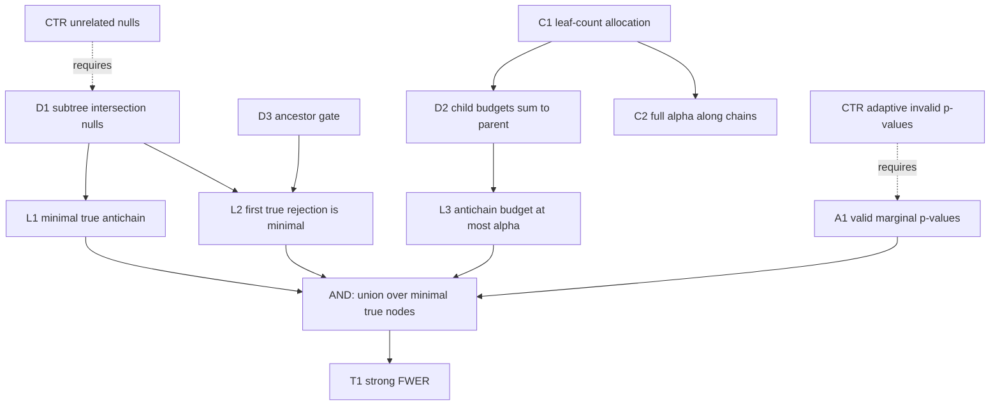

# Nested HCRD tree calibration

**Need.** Replace flat Holm correction by a calibration that uses the nested
interval tree without claiming uniform superiority or assuming independent
p-values.

## Normalized statement

Let $T$ be a finite rooted tree. Associate to each node $v$ the intersection
null

$$
H_v:\quad\text{there is no signal anywhere in the subtree rooted at }v.
$$

Hence $H_v$ true implies every descendant null is true. Let $p_v$ be a valid
marginal p-value for $H_v$; arbitrary dependence is allowed. Assign local
levels $a_v$ with $a_{\rm root}=\alpha$ and

$$
\sum_{u\in\operatorname{child}(v)}a_u\le a_v.
$$

Test the root at $a_{\rm root}$ and test a non-root node at $a_v$ only if every
ancestor has rejected. Then the probability of rejecting any true null is at
most $\alpha$.

The implemented default lets $L_v$ be the number of descendant leaves and sets
$a_u=a_vL_u/\sum_{w\in\operatorname{child}(v)}L_w$. It conserves the full
parent budget. Along a one-child chain the level remains $\alpha$, whereas flat
Holm initially uses $\alpha/|T|$. This can be more powerful for coherent nested
signals but is not uniformly more powerful for isolated leaves.

The theorem requires intersection/subtree nulls. Ordinary per-lobe hypotheses
do not automatically have this logical property; parent p-values must be valid
for the complete subtree, for example via a fixed-family subspace/scan test.

## Node table

| ID | Type | Content |
|---|---|---|
| D1 | DEF | finite rooted tree and subtree intersection nulls |
| D2 | DEF | local levels with child-budget conservation |
| D3 | DEF | ancestor-gated rejection rule |
| A1 | ASM | every true-node p-value is marginally superuniform |
| A2 | ASM | tree/family fixed or independent-guide selected |
| L1 | LEM | minimal true nodes form an antichain |
| L2 | LEM | rejection of any true node implies rejection of a minimal true node |
| L3 | LEM | local levels of every antichain sum to at most $\alpha$ |
| T1 | THM | strong FWER control under arbitrary dependence |
| C1 | COR | descendant-leaf allocation conserves budgets |
| C2 | COR | a one-child chain reuses level $\alpha$ |
| CTR1 | CTR | unrelated parent/child nulls invalidate minimal-true gatekeeping |
| CTR2 | CTR | same-noise tree selection invalidates nominal node p-values |
| CTR3 | CTR | a procedure testing descendants after parent failure is not this theorem |

## Edge table

| From | Relation | To |
|---|---|---|
| D1 | gives | L1 |
| D1, D3 | gives | L2 |
| D2 | gives | L3 |
| A1, L1, L2, L3 | AND: implies | T1 |
| leaf counts | instantiates | D2 and C1 |
| C1 | implies | C2 |
| CTR1 | fails_without | D1 |
| CTR2 | fails_without | A1/A2 |
| CTR3 | fails_without | D3 |

## Mermaid DAG

## First use of hypotheses

- Logical nesting is first used to show that the boundary between false and
  true nulls consists of an antichain of minimal true nodes.
- Ancestor gating is first used to reduce every true rejection to a rejection
  on that boundary.
- Budget conservation is first used in the inductive antichain-sum lemma.
- Marginal superuniformity is used only in the final union bound; p-value
  independence is never used.

## Compressed proof skeleton

1. Let $M$ be the set of true nodes whose parents are false or absent. Logical
   nesting makes $M$ an antichain.
2. A rejected true descendant can be reached only after its ancestors reject,
   so some node in $M$ must have rejected first.
3. Child-budget conservation implies by induction that the local levels of any
   antichain sum to at most the root level $\alpha$.
4. Therefore
   $P(\text{any false rejection})\le\sum_{v\in M}P(p_v\le a_v)
   \le\sum_{v\in M}a_v\le\alpha$.

## Adversarial batch review

**First failure.** HCRD geometrically nested intervals do not by themselves
make the statistical nulls logically nested.

**Repair.** $H_v$ is explicitly defined as the intersection null over the
entire subtree. A scalar test of only the parent lobe cannot be substituted.

**Next failure.** Calling the procedure “sharper than Holm” could mean uniform
dominance, which is false for isolated leaves in a broad tree.

**Repair.** The claim is structural: it preserves full level along supported
chains and may gain power for coherent nested alternatives; no uniform
dominance is asserted.

**Next failure.** Conditional validity after a random HCRD tree is not automatic.

**Repair.** A2 requires a fixed or independent-guide tree. Same-noise adaptive
selection remains outside the theorem.

## Counterexamples

**CTR1 — nonlogical nesting.** A parent tests positive mass while its child
tests negative mass. The parent null can be true while the child null is false,
so “parent true implies descendants true” fails and gatekeeping may hide a real
child alternative.

**CTR2 — adaptive p-values.** Choose the tree node with the smallest scoring
p-value and label it the root. Its nominal root p-value is not superuniform.

**CTR3 — bypassed gate.** If a child is tested despite a nonrejected parent,
the minimal-true boundary reduction no longer describes the procedure.

## Open extensions

Strong FWER for fixed/independent-guide subtree nulls is closed and implemented
by `hierarchical_tree_test`. Still `OPEN` are data-adaptive alpha recycling,
false-discovery-rate variants, and power-optimal allocation learned on a wholly
independent cohort.

**Internal-node retrieval prompt.** Reconstruct the antichain budget lemma and
explain why it replaces Holm's flat union over all nodes by a union only over
minimal true nodes.
