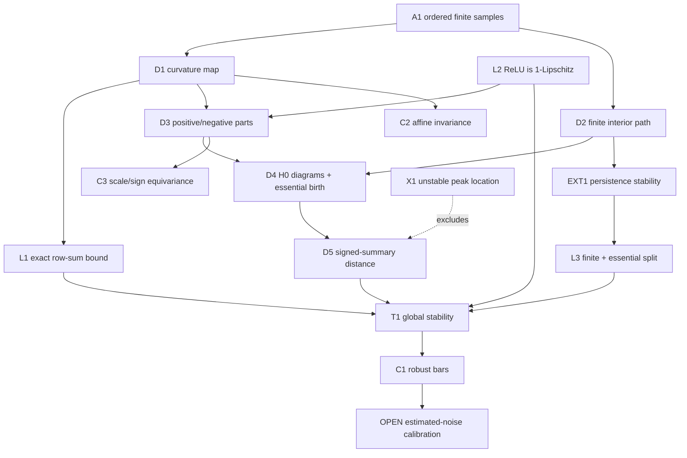

# Proof DAG: globally stable signed-curvature persistence

**Need.** Replace discontinuous hard knot coordinates by a globally stable
summary that still records the scale and sign of discrete curvature lobes.
The target is not exact generic agreement with HCRD knots, which T8 in the main
proof DAG proves impossible for a continuous hard-decision map.

## Normalized theorem signature

Let (x_0<\cdots<x_{n-1}), let (D_x:\mathbb R^n\to\mathbb R^{n-2})
be the divided-curvature matrix, and let (P) be the path whose vertices are
the interior sample indices.  For (y\in\mathbb R^n), define the nonnegative
vertex functions

\[
u_y^+=(D_xy)_+=\max(D_xy,0),\qquad
u_y^-=(-D_xy)_+.
\]

Extend each vertex function linearly over the edges of (P).  Let
(\operatorname{Dgm}^{\rm fin}_0(u)) be the finite part of its ordinary
zero-dimensional superlevel persistence diagram and let
(M(u)=\max u) be the birth of the unique essential component (with value zero
when (P) is empty).  Define

\[
\begin{split}
d_{\rm SC}(y,z)=\max\{&d_B(\operatorname{Dgm}^{\rm fin}_0(u_y^+),
                         \operatorname{Dgm}^{\rm fin}_0(u_z^+)),
|M(u_y^+)-M(u_z^+)|,\\
&d_B(\operatorname{Dgm}^{\rm fin}_0(u_y^-),
     \operatorname{Dgm}^{\rm fin}_0(u_z^-)),
|M(u_y^-)-M(u_z^-)|\}.
\end{split}
\]

For (n\ge3), put

\[
C_x=\|D_x\|_{\infty\to\infty}
=2\max_{1\le i<n-1}\left{
(x_i-x_{i-1})^{-1}+(x_{i+1}-x_i)^{-1}\right},
\]

and put (C_x=0) for (n=2).  Then

\[
\boxed{d_{\rm SC}(y,z)\le C_x\|y-z\|_\infty.}
\]

If (\|y-z\|_\infty\le\varepsilon), every finite signed-curvature bar of
(y) with lifetime greater than (2C_x\varepsilon) must be matched to a
finite bar of the same sign for (z); it cannot disappear into the diagonal.

## Node table

| ID | Type | Content |
|---|---|---|
| A1 | ASM | (x_0<\cdots<x_{n-1}) and (n\ge2) |
| D1 | DEF | Divided-curvature linear map (D_x) |
| D2 | DEF | Interior path (P) and PL extension of vertex functions |
| D3 | DEF | (u_y^+=(D_xy)_+), (u_y^-=(-D_xy)_+) |
| D4 | DEF | Finite superlevel diagrams and essential birth (M(u)) |
| D5 | DEF | Signed-summary distance and signal pseudometric (d_{\rm SC}) |
| L1 | LEM | (\|D_xv\|_\infty\le C_x\|v\|_\infty) with the stated exact row-sum constant |
| L2 | LEM | Positive-part map is 1-Lipschitz in (\ell_\infty) |
| EXT1 | EXT | Persistence-diagram stability: (d_B(\operatorname{Dgm}(f),\operatorname{Dgm}(g))\le\|f-g\|_\infty) for tame continuous functions on a common triangulable space |
| L3 | LEM | On a connected finite path, deleting the single essential point and recording its birth separately preserves the EXT1 bound |
| T1 | THM | Global signed-curvature persistence stability |
| C1 | COR | Lifetime (>2C_x\varepsilon) forces a same-sign finite match |
| C2 | COR | Addition of an affine sampled function leaves the signature invariant |
| C3 | COR | Positive rescaling scales all birth/death values and the distance; negative rescaling swaps signs and scales by its magnitude |
| X1 | CTR | Peak/knot coordinates cannot be appended to this pseudometric with a global Lipschitz guarantee |
| O1 | OPEN | Statistical calibration of a lifetime threshold when the perturbation radius is estimated from data |

## Edge table

| From | Relation | To |
|---|---|---|
| A1 | permits | D1, D2 |
| D1, A1 | give row norm | L1 |
| D1 | feeds | D3 |
| D3 | uses | L2 |
| D2, D3 | define | D4 |
| D4 | defines | D5 |
| D2, finiteness of (P) | verify hypotheses of | EXT1 |
| EXT1, connectedness of (P) | imply | L3 |
| L1, L2, L3 | imply | T1 |
| T1, diagonal cost (=(b-d)/2) | imply | C1 |
| (D_x\ell=0), D3 | imply | C2 |
| linearity of (D_x), D3 | imply | C3 |
| X1 | fails_without | omission of peak coordinates from D5 |
| O1 | required_by | automatic significance decisions from noisy data |

## Mermaid DAG

## First use of hypotheses

- Strict ordering of samples is first used to make every divided-curvature
  coefficient finite and to compute the positive row-sum constant (C_x).
- Finiteness of the path is first used to ensure that the PL functions are tame
  and their diagrams are finite.
- A common path is first used when invoking persistence stability; changing the
  sampling grid requires either interpolation to a common complex or a separate
  metric for varying domains.
- Connectedness of the nonempty path is first used to assert that there is
  exactly one essential zero-dimensional class.
- The strict lifetime inequality in C1 is first used to rule out a diagonal
  match, whose cost is half the lifetime.  Equality gives no survival claim.

## Ordinary proof

For an interior sample (i), the divided-curvature row has coefficients

\[
\left((x_i-x_{i-1})^{-1},
-[(x_i-x_{i-1})^{-1}+(x_{i+1}-x_i)^{-1}],
(x_{i+1}-x_i)^{-1}\right).
\]

Its absolute row sum is
(2[(x_i-x_{i-1})^{-1}+(x_{i+1}-x_i)^{-1}]), proving L1 and the exact induced
(\ell_\infty\) operator norm.  Since (r\mapsto\max(r,0)) is 1-Lipschitz,

\[
\|u_y^\pm-u_z^\pm\|_\infty
\le\|D_x(y-z)\|_\infty
\le C_x\|y-z\|_\infty.
\]

The finite path is triangulable and the PL extensions are continuous and tame,
so the stability theorem of Cohen--Steiner, Edelsbrunner, and Harer applies to
the sublevel functions (-u_y^\pm) and (-u_z^\pm); changing sign converts
superlevel to sublevel persistence without changing the sup norm.  In degree
zero a connected path has one essential point.  An essential point cannot be
matched to the diagonal or to a finite point at finite cost, so it matches the
other essential point with cost (|M(u_y^\pm)-M(u_z^\pm)|).  The remaining
matching restricts to the finite diagrams.  Taking the maximum over the two
signs proves T1.

For C1, a finite bar ((b,d)) costs ((b-d)/2) to match to the diagonal.  If
(b-d>2C_x\varepsilon), the T1 matching of cost at most
(C_x\varepsilon) cannot use the diagonal and must pair the bar with a finite
bar of the same signed diagram.

## Counterexample boundary

**X1, unstable coordinate metadata.**  Put two equal positive curvature peaks
far apart on the path.  Arbitrarily small opposite perturbations of their
heights exchange which peak gives the essential component.  The essential
birth changes by at most the perturbation size, but its recorded peak index can
jump across the entire path.  Therefore `peak_index` is useful metadata but is
not part of (d_{\rm SC}), and no coordinate-Lipschitz claim is made.

## External result ledger

- **EXT1:** D. Cohen-Steiner, H. Edelsbrunner, and J. Harer, “Stability of
  Persistence Diagrams,” *Discrete \& Computational Geometry* 37 (2007),
  103–120, DOI 10.1007/s00454-006-1276-5.  Used only after checking that the
  common domain is a finite triangulable path and the PL functions are tame and
  continuous.

## Bottleneck and OPEN obligation

The deterministic pseudometric stability theorem is closed.  The remaining persistence issue
is statistical, not topological: estimating a valid perturbation radius from
noisy observations without allowing deterministic curvature to contaminate the
noise estimate.  Until O1 is solved, a lifetime threshold based on an estimated
noise level is exploratory; a threshold based on a known deterministic
(\ell_\infty) radius has the proved C1 guarantee.

## Compressed proof skeleton

1. Bound divided curvature by its exact irregular-grid row-sum norm.
2. Pass the bound through positive and negative parts using ReLU contraction.
3. Apply classical persistence stability on the common finite path.
4. Pair the unique essential classes and take the maximum over both signs.
5. Compare a finite bar's half-lifetime diagonal cost with the stability radius.

## Internal-node retrieval prompt

Reconstruct the path from the three coefficients of one irregular curvature row
to the signed bottleneck bound.  Identify where the common-domain assumption is
used, why the essential maximum must be recorded separately, and why a lifetime
strictly greater than twice the error bound cannot disappear.
