**Need:** A theorem-level account of the raw and thresholded HCRD operators,
including the first point where every assumption is used and explicit failure
modes. `OPEN` denotes a statement that is not used downstream as a proved result.

**Formal setting:** Let $x_0<\cdots<x_{n-1}$ and $y\in\mathbb R^n$.  Define
divided slopes

$$
s_i(y)=\frac{y_{i+1}-y_i}{x_{i+1}-x_i},\qquad 0\le i<n-1,
$$

and discrete curvature $\kappa_i(y)=s_i(y)-s_{i-1}(y)$ for
$1\le i<n-1$.  Starting at a knot $k$, extend through insignificant
curvatures and curvatures of one sign.  The first eligible sampled zero between
opposite signs, or otherwise the first opposite active curvature, closes the
interval.  Continue to $n-1$.  The selected knot set is $K(y)$ and $Ty$ is the
piecewise-linear interpolant through $(x_k,y_k)$ for $k\in K(y)$.

The exact mathematical operator has zero tolerance.  $T_\tau$ declares
$|\kappa_i|\le\tau$ insignificant.

## Normalized statements

1. **Exact reconstruction.** For $b^0=y$, $b^{j+1}=Tb^j$ and
   $d^{j+1}=b^j-b^{j+1}$, every finite prefix satisfies
   $y=\sum_{r=1}^j d^r+b^j$.
2. **Finite hierarchy.** With eligible knots restricted to the preceding knot
   set, the knot sets are nested and every nonterminal interval consumes at
   least two preceding intervals.  Hence
   $|K_{j+1}|-1\le\lceil(|K_j|-1)/2\rceil$ and the terminal chord is reached in
   at most $\max\{1,\lceil\log_2(n-1)\rceil\}$ implemented levels.
3. **Chord sign.** On a discretely convex interval, $y-Ty\le0$; on a concave
   interval, $y-Ty\ge0$.
4. **Affine equivariance.** At zero tolerance, for $a\ne0$ and affine
   $\ell_i=\alpha+\beta x_i$, $T(ay+\ell)=aTy+\ell$.
5. **Range and variation.** $\min y\le(Ty)_i\le\max y$ and
   $TV(Ty)\le TV(y)$.
6. **Within-cell stability.** On a unit grid, let
   $\gamma=\min_i|\Delta^2y_i|>0$ and
   $\eta=\min_{\Delta^2y_i\Delta^2y_{i+1}<0}
   ||\Delta^2y_i|-|\Delta^2y_{i+1}||$, with $\eta=+\infty$ when the set is
   empty.  For the centred rule, if
   $\|e\|_\infty<\min\{\gamma/4,\eta/8\}$, then the curvature signs,
   magnitude-comparison outcomes, and knots are fixed,
   $\|T(y+e)-Ty\|_\infty\le\|e\|_\infty$, and the detail changes by at most
   $2\|e\|_\infty$.
7. **Global discontinuity.** The raw operator is not continuous on all of
   $\mathbb R^n$.
8. **Gaussian threshold guarantee.** On a uniform grid of spacing $h$ with iid
   $N(0,\sigma^2)$ noise, with probability at least $1-\delta$ all curvature
   errors are bounded by
   $\tau=(\sigma/h)\sqrt{12\log(2(n-2)/\delta)}$.  Thus true zero curvatures are
   declared insignificant and curvatures of magnitude greater than $2\tau$
   retain their correct thresholded sign simultaneously.
9. **Finite-sample generative chord-lobe recovery.** On a uniform grid, suppose
   declared knots are at least two segments apart, the population curvature is
   zero at each interior knot, and the curvatures inside successive intervals
   have alternating constant sign and magnitude at least $\gamma$.  If
   $f=b+q$, $b$ is affine between declared knots, $q$ vanishes at them, and
   Gaussian-noise HCRD uses
   $\tau_\delta=(\sigma/h)\sqrt{12\log(4(n-2)/\delta)}$, then
   $\gamma>2\tau_\delta$ gives exact first-level knots with probability at
   least $1-\delta$, together with the stated baseline/detail sup-norm and MSE
   bounds.
10. **Curvature visibility.** If $y=g+a\sin(\omega t)$ and
    $g''\ge c>|a|\omega^2$ on an interval, then $y''>0$ there and the oscillation
    creates no inflection knot.
11. **No continuous generic-agreement extension.** Let
    $G=\{y:\min_i|\kappa_i(y)|>0\}$.  There is no map $F:\mathbb R^n\to
    \mathbb R^n$ that is continuous everywhere and agrees with the raw HCRD
    baseline $T$ on $G$.
12. **Globally stable proximal companion.** For the divided-curvature matrix
    $D$ and a proper closed convex penalty $\phi$, define
    $$P_\phi y=\mathop{\rm argmin}_z
      \tfrac12\|y-z\|_2^2+\phi(Dz).$$
    Both $P_\phi$ and $Q_\phi=I-P_\phi$ are firmly nonexpansive,
    $y=P_\phi y+Q_\phi y$ exactly, and
    $P_\phi(y+\ell)=P_\phi y+\ell$ for $D\ell=0$.  Implemented examples are
    $\phi(u)=\lambda\|u\|_1$ and
    $\phi(u)=\tfrac\lambda2\|u\|_2^2$.
13. **Certified guide curvatures.** If $\|e\|_2\le\rho$, then
    $\|P_\phi(y+e)-P_\phi y\|_2\le\rho$.  On an irregular grid the
    curvature error at sample $i$ is therefore at most
    $$c_i\rho=2\rho\left((x_i-x_{i-1})^{-1}+
      (x_{i+1}-x_i)^{-1}\right).$$
    Every guide curvature with magnitude greater than $c_i\rho$ has an
    invariant sign throughout that input ball; all other entries must be
    reported as uncertified.
14. **Globally stable signed-curvature persistence.** On the path of interior
    samples, take ordinary zero-dimensional superlevel persistence separately
    for $(D_xy)_+$ and $(-D_xy)_+$.  Combine the bottleneck distances of the
    finite diagrams with the differences between their essential birth heights.
    Then
    $$d_{\rm SC}(y,z)\le C_x\|y-z\|_\infty,$$
    where
    $C_x=2\max_i\{(x_i-x_{i-1})^{-1}+(x_{i+1}-x_i)^{-1}\}$.
    Consequently a finite same-sign bar with lifetime greater than
    $2C_x\varepsilon$ cannot disappear under an input perturbation bounded by
    $\varepsilon$ in $\ell_\infty$.

## Node table

| ID | Type | Content |
|---|---|---|
| D1 | DEF | Divided slopes $s_i$ and curvature $\kappa_i$ |
| D2 | DEF | Greedy eligible knot rule $K$ |
| D3 | DEF | Chord interpolant $T$ |
| D4 | DEF | Hierarchy $b^{j+1}=Tb^j$, $d^{j+1}=b^j-b^{j+1}$ |
| A1 | ASM | Strictly increasing finite sample locations |
| A2 | ASM | Zero tolerance for exact affine equivariance |
| A3 | ASM | Eligible knots at level $j+1$ are restricted to $K_j$ |
| A4 | ASM | Unit or uniform grid for the stated stability/noise constants |
| L1 | LEM | Linear interpolation is a convex combination of endpoint values |
| L2 | LEM | A subsampled polygonal path cannot have larger total variation |
| L3 | LEM | Convex samples lie below their endpoint chord; concave samples lie above |
| L4 | LEM | $\|\Delta^2e\|_\infty\le4\|e\|_\infty$ on the unit grid |
| L5 | LEM | With fixed knots, chord interpolation is 1-Lipschitz in $\ell_\infty$ |
| D7 | DEF | Centred transition margin $\eta$ between adjacent opposite-sign curvature magnitudes |
| L11 | LEM | Each difference of absolute curvature magnitudes moves by at most $8\|e\|_\infty$ on the unit grid |
| L6 | LEM | One HCRD interval passes at least one old interior eligible knot |
| L7 | LEM | Gaussian tail plus union bound for $n-2$ dependent curvature errors |
| A7 | ASM | Alternating active curvature blocks, isolated zero-curvature joins, and two-segment knot gaps |
| L13 | LEM | Preserved active signs plus isolated inactive joins force the centred first-level walk to select the declared knots |
| D5 | DEF | Convex proximal curvature guide $P_\phi$ and residual $Q_\phi=I-P_\phi$ |
| A5 | ASM | Exact proximal minimizer of the proper closed convex curvature penalty |
| L8 | EXT | A proximal map and its Moreau residual are firmly nonexpansive |
| L9 | LEM | Irregular curvature-row $\ell_1$ norm is $2(h_{i-1}^{-1}+h_i^{-1})$ |
| L12 | LEM | The $(n-2)\times n$ divided-curvature matrix has full row rank |
| D6 | DEF | Positive/negative curvature functions and their finite $H_0$ superlevel diagrams plus essential births |
| A6 | ASM | Both signals use the same finite path; vertex functions are extended linearly on it |
| L10 | LEM | Positive and negative part maps are 1-Lipschitz in $\ell_\infty$ |
| EXT2 | EXT | Bottleneck stability of persistence diagrams for tame continuous functions on a common triangulable space |
| T1 | THM | Exact reconstruction |
| T2 | THM | Nested finite logarithmic hierarchy |
| T3 | THM | Sign-definite structures |
| T4 | THM | Affine equivariance |
| T5 | THM | Range and total-variation contraction |
| T6 | THM | Within-cell stability |
| T7 | THM | Family-wise Gaussian threshold guarantee |
| T8 | THM | No globally continuous map can agree with raw HCRD on every generic signal |
| T9 | THM | Exact, affine-equivariant, globally nonexpansive proximal guide/residual split |
| T10 | THM | Input-ball certificate for proximal-guide curvature signs on irregular grids |
| T11 | THM | Global $d_{\rm SC}\le C_x\|y-z\|_\infty$ stability of signed-curvature persistence |
| T12 | THM | Finite-sample boundary and component recovery on the generative chord-lobe class |
| C1 | COR | Deterministic chord interpolation after correct knot selection |
| C2 | COR | Implemented centred knot-only hierarchy has $O(n)$ total work/storage |
| C3 | COR | Strong background curvature can hide a real oscillation |
| C4 | COR | Bars with lifetime $>2C_x\varepsilon$ survive as finite same-sign matches |
| X1 | CTR | Global discontinuity at a zero-curvature boundary |
| X2 | CTR | $L_2$ energy need not contract |
| X3 | CTR | Quadratic trend is extracted as a single curvature lobe |
| X4 | CTR | Fixed curvature signs alone do not fix a tied centred transition |
| O1 | OPEN | Full characterization of which sign patterns the centred rule can produce |
| O2 | OPEN | Stability of the plug-in MAD threshold when signal curvature contaminates MAD |
| O3 | RESOLVED | Signed-curvature lobe persistence is stable; hard coordinates are excluded from the metric |
| O4 | OPEN | Conditions under which Hilbert instantaneous frequency is meaningful |

## Edge table

| From | Relation | To |
|---|---|---|
| A1, D1 | define | D2 |
| D2 | defines | D3 |
| D3 | gives | L1 |
| D2, A3 | give | L6 |
| L6 | implies | T2 |
| D4 | telescopes to | T1 |
| D1, D2, L3 | imply | T3 |
| A2, D1, D2, D3 | imply | T4 |
| L1 | implies range part of | T5 |
| L2, D3 | imply variation part of | T5 |
| A4 | used first in | L4 |
| L4, D7, L11, L5 | imply | T6 |
| A4, L7 | imply | T7 |
| T7, A7 | imply | L13 |
| L13, C1, Gaussian maximum bound | imply | T12 |
| X1, genericity of both one-sided sequences | imply | T8 |
| D5, A5, L12, L8 | imply | T9 |
| T9, L9 | imply | T10 |
| D1, L9, L10, A6, EXT2 | imply | T11 |
| T11, diagonal matching cost | imply | C4 |
| D3, piecewise-affine $b$, and $q=0$ on selected knots | imply | C1 |
| T2 | implies | C2 |
| X1 | contradicts | global continuity of $T$ |
| T8 | contradicts | any globally continuous hard-knot replacement that preserves every generic raw decision |
| T8 | motivates but does not contradict | T11, because no hard coordinates enter $d_{\rm SC}$ |
| X2 | contradicts | $L_2$ contraction |
| X3 | fails_without | a curvature-separation assumption |
| X4 | fails_without | the $\eta$ margin in centred-rule T6 |
| D1 | implies | C3 by the continuous curvature bound |
| O4 | required by | any HHT/IMF interpretation |

## Mermaid DAG

```mermaid
flowchart TD
  D1["D1 slopes and curvature"] --> D2["D2 knot rule"]
  A1["A1 ordered samples"] --> D1
  A3["A3 eligible old knots"] --> L6["L6 skips an old knot"]
  D2 --> L6
  L6 --> T2["T2 finite nested hierarchy"]
  T2 --> C2["C2 sparse linear work"]
  D2 --> D3["D3 chord operator"]
  D3 --> D4["D4 details"]
  D4 --> T1["T1 exact reconstruction"]
  D3 --> L1["L1 convex combinations"]
  L1 --> T5["T5 range and TV"]
  L2["L2 polygonal TV"] --> T5
  L3["L3 chord inequality"] --> T3["T3 signed lobes"]
  A2["A2 zero tolerance"] --> T4["T4 affine equivariance"]
  D1 --> T4
  D3 --> T4
  A4["A4 uniform grid"] --> L4["L4 curvature perturbation"]
  D3 --> L5["L5 fixed-knot Lipschitz"]
  L4 --> T6["T6 within-cell stability"]
  D7["D7 magnitude margin"] --> T6
  L11["L11 comparison perturbation"] --> T6
  L5 --> T6
  A4 --> L7["L7 Gaussian union bound"]
  L7 --> T7["T7 robust threshold"]
  A7["A7 isolated alternating joins"] --> L13["L13 exact centred walk"]
  T7 --> L13
  D3 --> C1["C1 chord interpolation"]
  L13 --> T12["T12 generative recovery"]
  C1 --> T12
  X1 --> T8["T8 no continuous generic extension"]
  D5["D5 proximal guide split"] --> T9["T9 global nonexpansiveness"]
  A5["A5 exact convex prox"] --> T9
  L8["L8 prox/Moreau theorem"] --> T9
  L12["L12 curvature surjectivity"] --> T9
  T9 --> T10["T10 certified guide signs"]
  L9["L9 irregular row norm"] --> T10
  D1 --> D6["D6 signed curvature diagrams"]
  A6["A6 common finite path"] --> EXT2["EXT2 persistence stability"]
  D6 --> T11["T11 global signed persistence"]
  L9 --> T11
  L10["L10 ReLU contraction"] --> T11
  EXT2 --> T11
  T11 --> C4["C4 robust bars"]
  X1["X1 discontinuity"] -. contradicts .-> T6
  T8 -. excludes hard coordinates .-> T11
  T10 --> T11
  T11 --> O4["OPEN Hilbert meaning"]
```

## First use of hypotheses

- Strict ordering of $x_i$ is first used to define divided slopes and positive
  interpolation weights.
- Zero tolerance is first used when an affine addition leaves every curvature
  comparison exactly unchanged.  A fixed absolute tolerance breaks scale
  equivariance.
- Eligibility restriction is first used in the nesting step.  Without it, an
  implementation may insert redundant grid points inside an old affine segment.
- Uniform spacing is first used in the constant 4 in the deterministic
  perturbation bound and in the variance $6\sigma^2/h^2$.
- Isolated zero-curvature joins and two-segment gaps are first used to turn
  simultaneous sign preservation into exact centred boundary selection.  The
  explicit unequal-amplitude counterexample in
  `chord_lobe_recovery_proof_dag.md` shows that this is not cosmetic.
- The curvature margin $\gamma>0$ is first used to preserve the sign cell.  It
  cannot be removed, as X1 shows.
- The centred comparison margin $\eta>0$ is first used after signs are fixed,
  when the rule chooses the smaller-magnitude side of an unsampled transition.
  It cannot be omitted, as X4 shows.
- Convexity and exact solution of the proximal problem are first used to invoke
  firm nonexpansiveness.  A finite-iteration numerical solver only approximates
  this mathematical map and must be checked to its stated tolerance.
- The input $\ell_2$ radius is first converted to a guide $\ell_2$ radius by
  T9 and then to a coordinatewise curvature bound by L9.
- The common finite path is first used to apply persistence-diagram stability.
  Finiteness makes the PL functions tame, and connectedness gives exactly one
  essential zero-dimensional class for each sign.

## Ordinary proof sketches

**T1.** Expand $d^r=b^{r-1}-b^r$ and telescope.  No geometric property is
needed.

**T2.** A nonterminal interval closes only after passing the first active old
curvature and reaching an eligible zero or the first opposite active curvature.
The first opposite point is at least two local indices past the start; a sampled
zero is one past the last active point; and selection of the departing side is
allowed only when it is not the first active point.  Thus every nonterminal new
interval consumes at least two old intervals.  If $N'$ new intervals partition
$N$ old intervals, with only the last allowed to consume one, then
$N\ge2(N'-1)+1$ and $N'\le\lceil N/2\rceil$.  Iteration gives
$N_j\le\lceil(n-1)/2^j\rceil$ and the stated depth.  Full boundary cases appear
in `paper/appendix_proofs.tex`.

**T3.** On a convex sampled sequence, the piecewise-linear graph lies below the
secant joining the interval endpoints.  Subtracting the secant gives a
nonpositive detail.  Reverse inequalities for concavity.

**T4.** Added affine functions cancel from all divided-slope differences.
Multiplication by nonzero $a$ either preserves or reverses every curvature sign,
without changing transition locations.  Linear interpolation commutes with
scaling and affine addition.

**T5.** At every sample, the chord value is a convex combination of two selected
sample values.  For variation, each chord contributes the absolute difference
of its endpoint values; by the triangle inequality this does not exceed the
variation of the removed subpath.

**T6.** The second-difference perturbation has coefficients $(1,-2,1)$, so its
absolute value is at most $4\|e\|_\infty$.  The $\gamma$ margin fixes every
sign.  By the reverse triangle inequality, a difference of two absolute
curvature magnitudes changes by at most $8\|e\|_\infty$; the $\eta$ margin
therefore fixes every centred boundary comparison.  Signs and comparison
outcomes determine the knot walk.  With knots fixed, each interpolated error is
a convex combination of two endpoint errors.  Subtracting baseline error from
observation error gives the factor 2 for details.  For the legacy rule no
magnitude comparison occurs and the $\gamma$ margin alone suffices.

**T7.** Each curvature noise is Gaussian with variance $6\sigma^2/h^2$.
Although adjacent curvatures are dependent, a union bound does not require
independence.  Apply the standard Gaussian tail bound to all $n-2$ entries and
solve for $\tau$.  On the simultaneous event, true zeros remain within the
threshold and signals exceeding $2\tau$ cannot cross zero or fall below
$\tau$.

**C1.** Since $q$ vanishes at every correctly selected knot, the interpolant
through $b+q$ at those knots equals the piecewise-affine $b$.  Under noisy knot
ordinates the difference is instead the chord interpolant of the knot noise.

**T12.** Allocate $\delta/2$ to T7 and $\delta/2$ to the Gaussian sample
maximum.  On the T7 event, population joins remain inactive and every active
curvature remains active with its sign preserved.  A7 then presents the centred
walk with exactly one inactive eligible point between opposite blocks; the
two-segment gap makes the strict-coarsening correction inert.  Induction along
the walk gives the declared first-level knots.  C1 expresses the baseline error
as interpolated knot noise, so the sample-maximum event gives baseline sup error
$\epsilon_\delta$, detail sup error $2\epsilon_\delta$, and their squared MSE
bounds.  A union bound gives probability at least $1-\delta$.

**T8.** For $0<\varepsilon<1$, both
$y^\pm_\varepsilon=(-2,0,2\pm\varepsilon,-2)$ belong to $G$ and converge to
$y^0=(-2,0,2,-2)$.  If $F=T$ on $G$, the two output sequences are exactly the
two raw-HCRD sequences in X1, whose limits are separated by four.  Continuity
of $F$ at $y^0$ would force both to converge to $F(y^0)$, a contradiction.

**T9.** The objective defining $P_\phi$ is strongly convex, so the minimizer
is unique; existence and properness follow because $D$ is surjective and the
quadratic term is coercive.  The standard proximal-map theorem gives firm nonexpansiveness of
$P_\phi$; Moreau decomposition gives the same property for $Q_\phi$.
Their definition gives exact reconstruction.  If $D\ell=0$, substituting
$z'=z+\ell$ leaves the objective unchanged after translating $y$ by $\ell$,
which proves affine equivariance.  This external proximal theorem is supported
by Parikh and Boyd (2014); the L1 example is the trend-filtering functional of
Kim et al. (2009), while the quadratic example is a Tikhonov/Whittaker-type
curvature smoother.

**T10.** T9 gives $\|\delta P\|_2\le\|e\|_2\le\rho$, hence every coordinate
of $\delta P$ is at most $\rho$ in magnitude.  The three coefficients in the
$i$th divided-curvature row have absolute sum
$2(h_{i-1}^{-1}+h_i^{-1})$.  H\"older's inequality gives the stated error
bound.  A curvature farther from zero than this bound cannot change sign.
This is only a sign certificate.  For the centred rule, fixed knots additionally
require certified magnitude-comparison outcomes as in corrected T6; with
abstentions, only the reported signs carry the T10 guarantee.

**T11.** Each row of $D_x$ has absolute coefficient sum
$2(h_{i-1}^{-1}+h_i^{-1})$, hence
$\|D_x(y-z)\|_\infty\le C_x\|y-z\|_\infty$.  Positive and negative parts do
not enlarge this norm.  Apply the stability theorem of Cohen--Steiner,
Edelsbrunner, and Harer to the PL functions on the common finite path (using
their negatives to convert superlevel to sublevel persistence).  The unique
essential classes must match each other; their birth cost is the difference of
the two maxima.  The remaining matching is between finite diagrams.  Taking
the maximum over both signs gives T11.  A finite bar costs half its lifetime to
match to the diagonal, so a lifetime exceeding $2C_x\varepsilon$ forces a
finite same-sign match, proving C4.  Peak indices are metadata and are excluded
from the metric because arbitrarily small perturbations can swap two equal
distant maxima.

## Counterexamples

**X1, global discontinuity.** Let
$y^\pm=(-2,0,2\pm\varepsilon,-2)$.  Their $\ell_\infty$ distance is
$2\varepsilon$, but under the legacy rule the first baseline for $y^+$ tends to
$(-2,0,2,-2)$ and for $y^-$ equals $(-2,-2,-2,-2)$.  The output separation
tends to 4.

**X2, no energy contraction.** For $y=(-2,-1,-2)$, $Ty=(-2,-2,-2)$, so
$\|Ty\|_2>\|y\|_2$.

**X3, no generic trend/oscillation separation.** For $y_i=x_i^2$, the whole
signal is one convex run.  Its deviation from the endpoint chord is extracted
as one signed detail despite being a conventional smooth trend.

**X4, sign margin alone is insufficient for the centred rule.**  The signal
$y=(0,0,1,3,4)$ has curvature $(1,1,-1)$ and selects knot 3.  For every
sufficiently small $\varepsilon>0$,
$z_\varepsilon=(0,0,1,3-\varepsilon,4-2\varepsilon)$ has the same curvature
signs but selects knot 2 because the magnitude tie is broken.  Thus the old
sign-only form of T6 was false; the corrected form includes $\eta$.

## Bottleneck

T8 closes the originally overstrong hard-coordinate version of O3 negatively:
no continuous hard-knot map can preserve all generic raw HCRD decisions.  T11
closes the well-posed replacement positively: signed curvature lobes have a
globally stable persistence metric, while peak indices remain non-metric
metadata.  T9 independently supplies a globally stable exact outer split and
T10 supplies honest sign certificates.  The proximal guide itself is
established trend filtering and is not claimed as a novel operator.

## Compressed proof skeleton

1. Define divided curvature, eligible greedy knots, chord operator, and details.
2. Use the greedy progression to prove nested halving and finite termination.
3. Use secant geometry for signed lobes, range preservation, and TV contraction.
4. Use affine cancellation for equivariance and deterministic chord
   interpolation after correct selection.
5. Split stability into fixed-sign cells; prove local Lipschitz bounds and show
   global discontinuity by X1.
6. Add a simultaneous Gaussian curvature threshold using a union bound, then
   combine it with isolated alternating joins and a sample-maximum event for
   finite-sample generative recovery.
7. Use X1 twice, through generic one-sided sequences, to rule out a continuous
   exact-agreement extension.
8. Introduce the proximal curvature guide, invoke firm nonexpansiveness, and
   derive irregular-grid sign certificates from the curvature-row norm.
9. Apply positive/negative-part contraction and persistence-diagram stability
   on the interior path to obtain the global signed bottleneck theorem.

## Internal-node retrieval prompt

Recover the path from ordered samples and eligible knots to L6.  Explain why L6
implies both termination and sparse $O(n)$ work, then identify precisely why
selecting an arbitrary zero inside an old affine plateau would break the path.

## Open extensions

- **O1:** characterize centred-rule sign patterns and all degeneracies caused by
  zero-curvature plateaus.
- **O2:** quantify bias and concentration of the MAD plug-in noise estimate in
  the presence of deterministic signal curvature.
- **O3 (resolved in the admissible form):** signed curvature-lobe persistence
  has metric stability without exact hard-coordinate agreement.  Peak and knot
  coordinates remain explicitly outside the stable metric.
- **O4:** either prove conditions for meaningful instantaneous phase/frequency
  or explicitly exclude Hilbert-spectrum claims from the paper.
- **O5 (resolved):** exhaustive finite sign patterns agree with the logarithmic
  recurrence, and the appendix now supplies the full boundary-case combinatorial
  proof and its sparse work/storage corollary.
