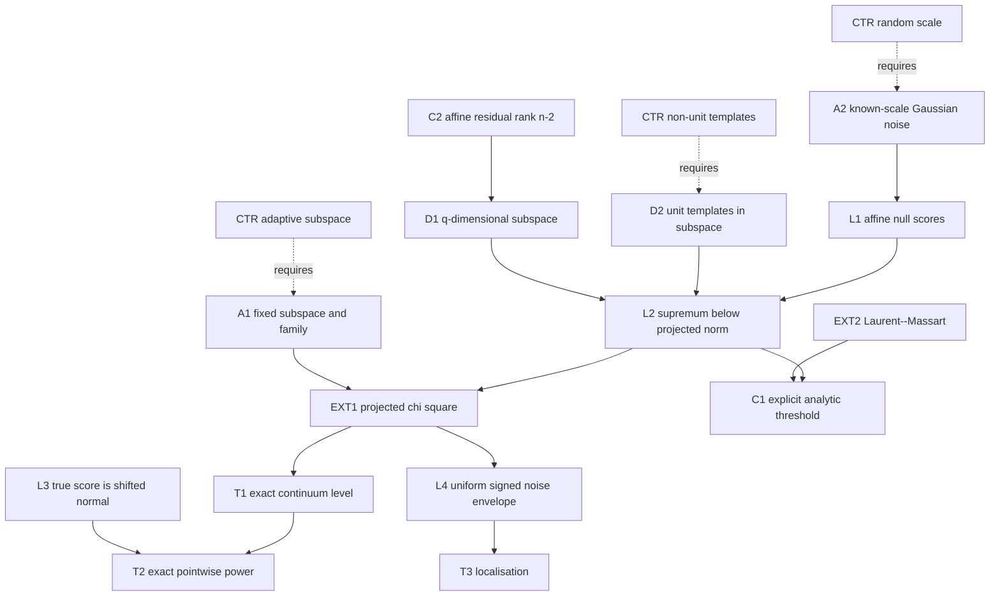

# Rank-aware continuous lobe scan

**Need.** Replace the numerically enormous Dudley sufficient norm by a valid
continuum calibration that uses the finite ambient dimension without replacing
the continuous family by a grid.

## Normalized statement

Let $U\subset\mathbb R^n$ be a deterministic subspace of dimension
$1\le q\le n$. Let $(v_\theta)_{\theta\in\Theta}\subset U$ be any fixed or
independent-guide family of unit vectors. Under the affine null,

$$
Y=g+\sigma Z,\qquad g\in\operatorname{range}(P),\quad
Z\sim N(0,I_n),quad \sigma>0,
$$

and every $v_\theta\in\operatorname{range}(I-P)$, define

$$
S(Y)=\sup_{\theta\in\Theta}{\langle v_\theta,Y\rangle\over\sigma}.
$$

Let $Q_q(1-\alpha)$ denote the $(1-\alpha)$ quantile of $\chi_q^2$ and put

$$
t_{q,\alpha}=\sqrt{Q_q(1-\alpha)}.
$$

Then:

1. **Exact rank-aware null control:**
   $\Pr_0\{S(Y)>t_{q,\alpha}\}\le\alpha$.
2. **Exact pointwise power:** under
   $Y=g+\sigma\mu v_{\theta_0}+\sigma Z$, the miss probability is at most
   $\beta$ whenever
   $$
   \mu\ge t_{q,\alpha}+\Phi^{-1}(1-\beta).
   $$
3. **Rank-aware localisation:** if
   $\Delta_{\theta_0}(r)>0$, every measurable maximiser lies within parameter
   radius $r$ with probability at least $1-\delta$ whenever
   $$
   \mu\Delta_{\theta_0}(r)>2t_{q,\delta}.
   $$
4. **Dependency-free analytic threshold:** Laurent--Massart gives the explicit
   replacement
   $$
   \bar t_{q,\alpha}=
   \sqrt{q+2\sqrt{q\log(1/\alpha)}+2\log(1/\alpha)}
   $$
   with the same level guarantee.
5. **Affine-residual corollary:** with
   $U=\operatorname{range}(I-P)$ for the design $(1,x)$,
   $q=n-\operatorname{rank}(1,x)=n-2$ for a nonconstant sampling grid.

No compactness, entropy integral, or finite sieve is needed for the level
bound. Separability/measurability is still needed to treat the displayed
supremum as an ordinary random variable; the compact continuous family in the
main theorem supplies it. The family and $U$ must be fixed or selected using
independent guide data, and $\sigma$ is known.

## Node table

| ID | Type | Content |
|---|---|---|
| D1 | DEF | deterministic $q$-dimensional subspace $U$ |
| D2 | DEF | unit template family $v_\theta\in U\cap\operatorname{range}(I-P)$ |
| D3 | DEF | scan supremum $S(Y)$ |
| A1 | ASM | $U$ and family fixed or independent of scoring noise |
| A2 | ASM | known $\sigma>0$ and iid Gaussian scoring noise |
| A3 | ASM | family is separable/measurable |
| L1 | LEM | affine null implies $\langle v_\theta,Y\rangle/\sigma=\langle v_\theta,Z\rangle$ |
| L2 | LEM | Cauchy--Schwarz: $S(Y)\le\|\Pi_UZ\|_2$ |
| EXT1 | EXT | $\|\Pi_UZ\|_2^2\sim\chi_q^2$ for deterministic orthogonal projection |
| EXT2 | EXT | Laurent--Massart upper tail for a chi-square variable |
| L3 | LEM | true-coordinate score is $N(\mu,1)$ |
| L4 | LEM | on $\|\Pi_UZ\|\le t$, all signed noise scores have magnitude at most $t$ |
| T1 | THM | exact chi-square continuous null control |
| T2 | THM | exact-normal pointwise power |
| T3 | THM | rank-aware localisation |
| C1 | COR | explicit dependency-free Laurent--Massart threshold |
| C2 | COR | affine residual rank is $n-2$ on a strictly increasing grid |
| CTR1 | CTR | data-selected $U$ need not have chi-square projection law |
| CTR2 | CTR | non-unit templates invalidate the unit-ball domination without a norm factor |
| CTR3 | CTR | unknown/random scale invalidates the displayed exact pivot |

## Edge table

| From | Relation | To |
|---|---|---|
| D2, A2 | gives | L1 |
| D1, D2, L1 | gives | L2 |
| A1, A2, D1 | instantiates | EXT1 |
| L2, EXT1 | implies | T1 |
| L3, T1 | implies | T2 |
| L4, identifiability modulus | implies | T3 |
| EXT2, L2 | implies | C1 |
| affine design rank | implies | C2 |
| CTR1 | fails_without | A1 |
| CTR2 | fails_without | D2 |
| CTR3 | fails_without | A2 |

## Mermaid DAG

## First use of hypotheses

- Determinism/independence of $U$ is first used when asserting the
  $\chi_q^2$ law for $\|\Pi_UZ\|^2$.
- Unit template norm is first used in Cauchy--Schwarz.
- Orthogonality to the affine design is first used when removing $g$ from every
  score.
- Known $\sigma$ is first used before standardising $Y$.
- Inclusion of the true template is first used in the pointwise power step.
- Positive identifiability modulus is first used only for localisation, not
  detection.

## Compressed proof skeleton

1. Affine residualisation makes every null score $\langle v_\theta,Z\rangle$.
2. Because $v_\theta$ is a unit vector in $U$,
   $\langle v_\theta,Z\rangle\le\|\Pi_UZ\|_2$ simultaneously for all $\theta$.
3. The squared projected norm is $\chi_q^2$, giving the exact level threshold;
   Laurent--Massart gives the closed-form threshold.
4. At the included true template the score is $N(\mu,1)$, so the exact normal
   quantile gives the power condition.
5. On the projected-norm event every signed noise score is bounded by the same
   $t_{q,\delta}$. The mean gap outside radius $r$ is
   $\mu\Delta_{\theta_0}(r)$, yielding localisation when it exceeds twice the
   noise envelope.

## Adversarial batch review

**First failure.** The phrase “the templates span a $q$-dimensional subspace”
would be insufficient if that span were computed from the scoring observation.
The projected Gaussian norm would then be adaptively enlarged.

**Repair.** $U$ and the family are explicitly deterministic or guide-selected
independently of scoring noise (A1).

**Next failure.** Cauchy--Schwarz gives a unit-ball bound only after proving
$\|v_\theta\|_2=1$ and $v_\theta\in U$ for every parameter.

**Repair.** Both facts are part of D2; the residual-norm margin in the parent
continuous theorem makes normalization well-defined.

**Next failure.** A chi-square threshold controls detection but does not by
itself prove power.

**Repair.** L3 uses the included true coordinate and the exact $N(\mu,1)$
lower tail; no union bound or entropy constant enters.

**Next failure.** The localisation comparison needs simultaneous control of
positive and negative noise increments.

**Repair.** The Euclidean norm controls absolute inner products for the entire
signed unit ball, so L4 is stronger than a signed entropy envelope.

**Next risk.** Replacing known $\sigma$ by an estimate or using temporally
dependent noise changes the projected-norm law. Those extensions remain
separate obligations and are not smuggled into T1--T3.

## Counterexamples

**CTR1 — adaptive subspace.** Select the one-dimensional span of the observed
Gaussian vector. Its projected norm is $\|Z\|$, not $|N(0,1)|$; using $q=1$
is anti-conservative.

**CTR2 — unnormalised class.** If $v_\theta=cv$ with arbitrarily large $c$,
the scan is unbounded relative to $\|\Pi_UZ\|$ unless the template norm is
included.

**CTR3 — random scale.** If $\widehat\sigma$ can approach zero on the scoring
sample, the standardised supremum can diverge even though the numerator has a
fixed Gaussian subspace bound.

## Limits and open extensions

For the 129-sample triangular audit, $q=127$. The exact threshold is 12.4218
and the exact-normal 80%-power sufficient norm is 13.2634; the dependency-free
Laurent--Massart values are 13.1150 and 13.9566. This replaces the earlier
Dudley sufficient norm 285.1103 without discretising the continuous family.
The finite 595-template sieve remains sharper (5.1739) because it scans a much
smaller declared set. Remaining `OPEN` items are estimated scale, dependent
noise, and class-specific calibration sharper than the ambient-rank envelope.

**Internal-node retrieval prompt.** Recover why fixedness of $U$ is necessary
for the chi-square law, then trace how the single projected-norm event controls
both the detection supremum and every signed localisation comparison.
