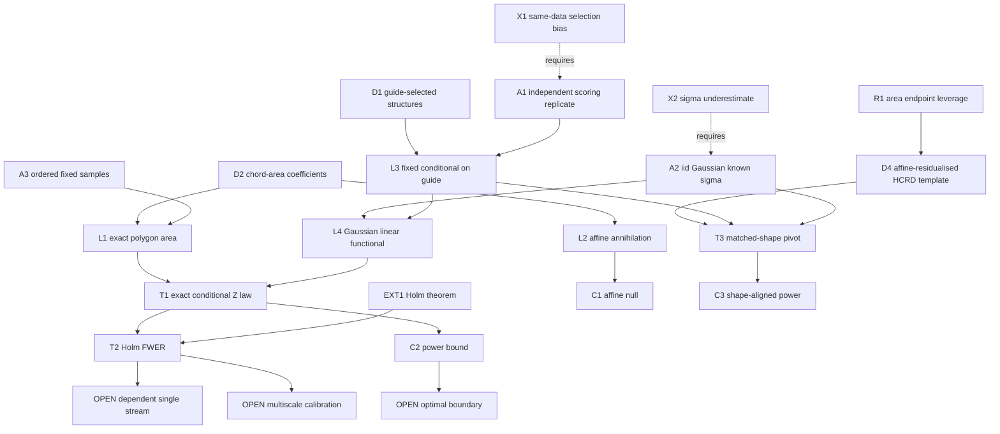

# Replicate-split inference for HCRD structures

**Need.**  Turn an adaptive, interpretable hierarchy into valid finite-sample
tests without pretending that data-dependent HCRD knots are fixed.  `OPEN`
marks work that is not yet proved.

## Normalized theorem

Let (G\in\mathbb R^n) be a guide signal and
(Y=f+e\in\mathbb R^n) an independent scoring replicate, where
(e\sim N(0,\sigma^2I)) and (\sigma>0) is known.  Run any deterministic HCRD
rule on (G).  For every selected structure (s), let
(I_s=(i_0<\cdots<i_k)) be the active samples between its retained endpoint
knots.  Let (w_j) be the trapezoidal integration weights on these locations,
and define

\[
c_{s,j}=w_j\quad(0\le j\le k),\qquad
c_{s,0}\mathrel{-}=\sum_jw_j{(x_{i_k}-x_{i_j})\over(x_{i_k}-x_{i_0})},
\qquad
c_{s,k}\mathrel{-}=\sum_jw_j{(x_{i_j}-x_{i_0})\over(x_{i_k}-x_{i_0})}.
\]

Then (M_s=c_s^TY_{I_s}) is the signed trapezoidal polygon area relative to
the endpoint chord.  Conditional on (G),

\[
 Z_s={M_s\over\sigma\|c_s\|_2}
 \sim N\!\left({c_s^Tf_{I_s}\over\sigma\|c_s\|_2},1\right).
\]

Consequently the two-sided p-values are exactly super-uniform for each true
linear null (H_s:c_s^Tf_{I_s}=0), despite adaptive guide selection.  Holm's
step-down correction over all nondegenerate selected structures controls the
conditional and unconditional family-wise error rate at level (\alpha)
under arbitrary overlap and dependence among the (Z_s).

If (m) structures are tested and a structure has standardized mean

\[
 {|c_s^Tf_{I_s}|\over\sigma\|c_s\|_2}
 \ge z_{1-\alpha/(2m)}+z_{1-\beta},
\]

then its Holm rejection probability is at least (1-\beta), because Holm is
uniformly at least as powerful as Bonferroni for that family.

### Full-shape matched extension

Let (q_s(G)) be the complete guide HCRD detail on the active samples of a
selected structure, let (P_s) be least-squares projection onto
(\operatorname{span}\{\mathbf1,x\}), and set
(v_s=(I-P_s)q_s(G)).  For nonzero (v_s),

\[
 T_s={v_s^TY_{I_s}\over\sigma\|v_s\|_2}
 \sim N\!\left({v_s^Tf_{I_s}\over\sigma\|v_s\|_2},1\right)
 \quad\text{conditionally on }G.
\]

All preceding validity and Holm conclusions therefore hold for the matched
shape as well.  Under the aligned model
(f_{I_s}=a+bx+a_s v_s), the noncentrality is
(a_s\|v_s\|_2/\sigma).  For a fixed-shape lobe of height (H) and (m)
active samples, this is of order (H\sqrt m/\sigma), whereas the endpoint-chord
area statistic can lose this width gain because endpoint noise has high
leverage.

## Node table

| ID | Type | Content |
|---|---|---|
| D1 | DEF | Guide-selected nested HCRD structures and their active index sets |
| D2 | DEF | Trapezoidal endpoint-chord coefficient vector (c_s) |
| D3 | DEF | Area (M_s), standard score (Z_s), and two-sided p-value |
| D4 | DEF | Affine-residualised guide template (v_s=(I-P_s)q_s(G)) and matched score (T_s) |
| A1 | ASM | Guide (G) is independent of scoring noise (e) |
| A2 | ASM | Scoring errors are iid centred Gaussian with known (\sigma>0) |
| A3 | ASM | Locations are fixed, finite, and strictly increasing |
| L1 | LEM | (c_s^TY) equals the signed trapezoidal residual-to-chord area |
| L2 | LEM | (c_s) annihilates affine sample vectors |
| L3 | LEM | Conditional on (G), every (c_s) is fixed |
| L4 | LEM | A fixed Gaussian linear functional has the stated normal law |
| EXT1 | EXT | Holm step-down controls FWER for valid p-values under arbitrary dependence |
| T1 | THM | Exact conditional normal law after independent guide selection |
| T2 | THM | Conditional and unconditional FWER control |
| T3 | THM | Exact conditional matched-shape normal law and Holm FWER |
| C1 | COR | Every affine mean interval satisfies the tested null |
| C2 | COR | Bonferroni-sufficient power bound, inherited by Holm |
| C3 | COR | Aligned-shape noncentrality (a_s\|v_s\|_2/\sigma) |
| X1 | CTR | Reusing the scoring noise to select the largest structure makes naive p-values anti-conservative |
| X2 | CTR | Underestimating (\sigma) destroys the nominal Gaussian level |
| R1 | RISK | Endpoint-chord area noise can scale linearly with interval width, erasing the expected (\sqrt m) power gain |
| O1 | OPEN | Valid single-series block/cross-fit analogue under temporal dependence |
| O2 | OPEN | Studentized result for robustly estimated (\sigma) with contamination |
| O3 | OPEN | Less conservative scale-aware multiscale critical values for the nested HCRD family |
| O4 | OPEN | Optimal detection boundary over stochastic chord-lobe dictionaries |

## Edge table

| From | Relation | To |
|---|---|---|
| D2, A3 | imply | L1 |
| D2 | implies | L2 |
| A1, D1 | imply | L3 |
| A2, L3 | imply | L4 |
| L1, L4 | imply | T1 |
| T1, EXT1 | imply | T2 |
| L2 | implies | C1 |
| T1, Gaussian tail bound | imply | C2 |
| D4, A1, A2 | imply | T3 |
| T3, aligned-shape model | imply | C3 |
| R1 | motivates | D4 |
| X1 | fails_without | A1 |
| X2 | fails_without | known upper bound in A2 |
| O1, O2 | required by | routine single-stream deployment |
| O3, O4 | required by | sharp multiscale detection theory |

## Mermaid DAG

## First use of hypotheses

- Independence is first used after conditioning on the guide: it prevents the
  scoring-noise vector from influencing the selected coefficient vectors.
- Gaussianity is first used to obtain an exact normal pivot.  With a known
  sub-Gaussian proxy one can derive conservative tails, but not the stated
  exact p-values.
- Knowledge of a valid (\sigma) upper bound is first used in the denominator.
  Equality gives exact p-values; an upper bound gives conservative ones.
- Strict ordering of locations is first used to define positive trapezoidal
  weights and a nonzero endpoint span.
- No independence among the structure p-values is assumed.  Holm is invoked
  precisely because structures overlap across intervals and levels.

## Proof skeleton

**L1.**  Trapezoidal integration is the weighted sum (w^TY).  The endpoint
chord at (x_{i_j}) is the indicated convex combination of its two endpoint
ordinates.  Expanding the weighted chord sum subtracts exactly the two endpoint
terms in the definition of (c_s).

**L2.**  The residual of any affine vector to its endpoint chord is zero, so
L1 gives (c_s^T(a+bx)=0).  Equivalently, (c_s^T\mathbf1=c_s^Tx=0).

**T1.**  Conditional on (G), the active indices and (c_s) are fixed by A1.
Thus (c_s^TY=c_s^Tf+c_s^Te), and A2 gives
(c_s^Te\sim N(0,\sigma^2\|c_s\|_2^2)).  Standardisation proves the pivot.

**T2.**  T1 makes every true-null p-value conditionally valid.  Apply Holm
conditionally for any realised guide.  Averaging the conditional error
probability over the guide preserves the same (\alpha) bound.

**C2.**  A two-sided Bonferroni test rejects when
(|Z_s|\ge z_{1-\alpha/(2m)}).  If the absolute normal mean exceeds this
threshold by (z_{1-\beta}), the probability of crossing in the correct
direction is at least (1-\beta).  Holm cannot reject fewer hypotheses than
Bonferroni at the same family level.

**T3.**  Conditional on the guide, (v_s) is fixed by A1.  By construction it
is orthogonal to both the constant and sampled-location vectors, so every
affine mean is annihilated.  Its scoring-noise projection is
(N(0,\sigma^2\|v_s\|_2^2)); standardisation gives the pivot.  Holm validity
then repeats T2 verbatim.

**C3.**  Under (f=a+bx+a_s v_s), affine orthogonality gives
(v_s^Tf=a_s\|v_s\|_2^2).  Divide by
(\sigma\|v_s\|_2).  For a sampled lobe whose nonzero shape occupies a fixed
fraction of (m) samples, (\|v_s\|_2\asymp H\sqrt m).

## Counterexamples

**X1 — same-data selection (`CTR`).**  Let (Z_1,Z_2\) be independent standard
normal null statistics and use the same data to select
(J=\arg\max_j|Z_j|).  Reporting the unadjusted selected p-value gives

\[
P(p_J\le\alpha)=1-(1-\alpha)^2>\alpha.
\]

The failure already occurs with two candidates.  Independent guide selection,
valid selective inference, or simultaneous correction over the pre-selection
family is essential.

**X2 — underestimated noise (`CTR`).**  If the true standard deviation is
(\sigma) but the denominator uses (\tilde\sigma<\sigma), the null pivot has
variance (\sigma^2/\tilde\sigma^2>1), hence its nominal normal tail is
anti-conservative.

**R1 — area endpoint leverage (`RISK`).**  On a unit grid with (m) intervals,
the signed-area coefficient has interior weights 1 and endpoint coefficients
(-(m-1)/2).  Hence (\|c_s\|_2^2=(m-1)+(m-1)^2/2), which is order (m^2).
A triangular lobe has area of order (Hm), so its area-test noncentrality is
only order (H/\sigma), not (H\sqrt m/\sigma).  Polygon area remains a useful
physical descriptor, but the full affine-residualised HCRD shape is the more
powerful inferential feature when a scoring replicate is available.

## Proof bottleneck and practical scope

The theorem is directly applicable to replicated cycles, repeated assays,
parallel sensors observing the same mean morphology, or train/test experiments
where one replicate selects structures and another quantifies them.  The
matched extension makes the main feature the complete decomposition shape,
with polygon area retained as interpretable metadata.  It is not yet a licence
to split an arbitrary autocorrelated single stream into adjacent samples.
Restricted closures are now available. `buffered_crossfit_inference_proof_dag.md`
closes `O1` for known-covariance Gaussian $m$-dependent streams using
distance-$m$ guide buffers; general mixing and estimated covariance remain
open. `nested_tree_calibration_proof_dag.md` closes `O3` for valid subtree
intersection nulls using ancestor gatekeeping; it is not valid for unrelated
per-structure nulls and is not claimed to uniformly dominate Holm.

## Retrieval prompt

Derive the chord-area coefficient vector, explain why it annihilates affine
signals, then identify exactly where guide/score independence enters and give
the two-statistic counterexample showing failure without it.
