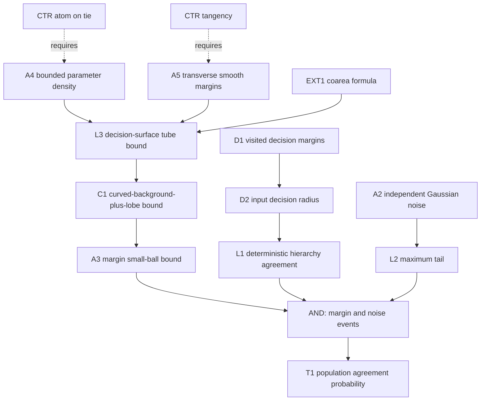

# Stochastic HCRD hierarchy margins

**Need.** Turn deterministic decision-cell margins for one known mean signal
into an unconditional hierarchy-agreement probability for a random
curved-background-plus-lobe population.

## Normalized statement

Fix a sampling grid, absolute curvature tolerance $\tau$, and depth $L$. For a
latent signal $F\in\mathbb R^n$, replay every threshold/sign/centred-comparison
decision visited by its noiseless HCRD hierarchy. Let $M_{\rm th}(F)$ be the
smallest distance of a visited curvature magnitude from $\tau$, and let
$M_{\rm cmp}(F)$ be the smallest absolute gap between curvature magnitudes in a
visited centred transition comparison. Put

$$
R(F)={h_{\min}\over4}
\min\{M_{\rm th}(F),M_{\rm cmp}(F)/2\},
$$

with an empty minimum interpreted as $+\infty$. The public function
`hcrd_hierarchy_decision_radius` computes this sufficient input radius.

Let $F$ be random and independent of $e\sim N(0,\sigma^2I_n)$. If, for some
$r>0$,

$$
\Pr\{R(F)\le r\}\le H(r),
$$

then

$$
\Pr\{K_\ell(F+e)=K_\ell(F),\ 1\le\ell\le L\}
\ge 1-H(r)-2n\exp\{-r^2/(2\sigma^2)\}.
$$

The right side is truncated below at zero and may be optimized over $r$.

For a concrete finite-dimensional curved-background-plus-lobe model
$F=F_\Theta$, let $\Theta$ have density bounded by $p_{\max}$ on a compact
parameter box. Partition the box into finitely many branch cells on which all
visited decision margins $m_j(\theta)$ are $C^1$. Assume that within
$|m_j|\le r_0$,

$$
\|\nabla m_j(\theta)\|_2\ge g_j>0
$$

and every level set $m_j^{-1}(u)$ has $(d-1)$-dimensional measure at most $A_j$
for $|u|\le r_0$. Then the coarea formula and a union bound give

$$
H(r)\le 2p_{\max}r\sum_j {A_j\over g_j},\qquad 0<r\le r_0,
$$

after incorporating the fixed factors relating $m_j$ to $R$. Thus random
amplitude, centre, width, asymmetry, and finitely parameterised curved
background coefficients have an explicit population agreement bound whenever
their decision surfaces are transverse. Tangencies and atoms on a decision
surface are not covered.

## Node table

| ID | Type | Content |
|---|---|---|
| D1 | DEF | visited threshold and comparison margins |
| D2 | DEF | decision radius $R(F)$ |
| A1 | ASM | fixed grid, tolerance, depth, and knot rule |
| A2 | ASM | latent $F$ independent of iid Gaussian noise |
| A3 | ASM | small-ball bound $P\{R(F)\le r\}\le H(r)$ |
| L1 | LEM | $\|e\|_\infty<R(F)$ preserves every visited branch and knot set |
| L2 | LEM | Gaussian maximum bound $P\{\|e\|_\infty\ge r\}\le2ne^{-r^2/(2\sigma^2)}$ |
| T1 | THM | unconditional hierarchy-agreement lower bound |
| A4 | ASM | finite-dimensional parameter density bounded by $p_{\max}$ |
| A5 | ASM | finite branch partition and transverse $C^1$ decision margins |
| EXT1 | EXT | coarea formula |
| L3 | LEM | tube probability around one decision surface is at most $2p_{\max}rA_j/g_j$ |
| C1 | COR | linear small-ball bound for the curved-background-plus-lobe model |
| CTR1 | CTR | atom on a tied decision surface gives nonvanishing $H(0)$ |
| CTR2 | CTR | tangential margin $m(\theta)=\theta^2$ has different small-ball exponent |
| CTR3 | CTR | signal-dependent scoring noise breaks the independence split |

## Edge table

| From | Relation | To |
|---|---|---|
| D1, deterministic margin theorem | defines | D2 |
| D2 | implies | L1 |
| A2 | gives | L2 |
| A3, L1, L2 | AND: gives | T1 |
| A4, A5, EXT1 | gives | L3 |
| L3, union bound | implies | C1 |
| CTR1 | fails_without | continuous/transverse population condition |
| CTR2 | fails_without | gradient lower bound in A5 |
| CTR3 | fails_without | A2 |

## Mermaid DAG

## First use of hypotheses

- The fixed tolerance and rule are first used when defining which branch
  margins enter $R(F)$.
- Independence of $F$ and $e$ is first used when separating the latent
  small-ball event from the Gaussian maximum event.
- Bounded density, smoothness, transversality, and surface-area bounds are first
  used in the coarea integral.
- No claim assumes that all latent parameter values have the same hierarchy;
  the branch-cell partition permits finitely many noiseless traces.

## Compressed proof skeleton

1. A sup-norm perturbation of size $u$ changes every visited curvature by at
   most $4u/h_{\min}$ and each compared magnitude gap by at most twice that.
2. Therefore $\|e\|_\infty<R(F)$ preserves every decision; induction preserves
   every knot set through level $L$.
3. On $\{R(F)>r\}\cap\{\|e\|_\infty<r\}$ agreement holds. Bound the complement
   by the assumed margin small-ball probability plus the Gaussian maximum tail.
4. In the parametric model, apply coarea to the $r$-tube of each decision
   surface and union-bound the finitely many branch margins.

## Adversarial batch review

**First failure.** Calling $R(F)$ “the largest stability radius” would be
unjustified; the curvature perturbation bound and margin minimum are only
sufficient.

**Repair.** The statement consistently calls it a deterministic sufficient
decision radius.

**Next failure.** A random hierarchy changes which comparisons are visited, so
a single smooth global margin list need not exist.

**Repair.** The parametric corollary assumes a finite branch-cell partition and
applies the tube bound within every cell.

**Next failure.** A bounded parameter density alone does not make near-ties
rare if a decision surface is tangent or has a flat region.

**Repair.** The nonzero gradient and uniform level-set area assumptions are
explicit. CTR1/CTR2 show why they are needed.

**Next risk.** Estimating $H$ from the same finite sample used to validate the
theorem needs its own confidence band. The theorem accepts a proved or
independently validated upper bound; a plug-in empirical CDF is not silently
treated as exact.

## Open extensions

The stochastic bridge is closed under an explicit margin small-ball condition
and under a finite-dimensional transverse curved-background-plus-lobe model.
Still `OPEN` are sharp constants for specific physical parameter priors,
infinite-dimensional random backgrounds, and data-dependent tolerance/noise
estimation.

**Internal-node retrieval prompt.** Recover how the factor $h_{\min}/4$ enters
$R(F)$, then trace how the coarea tube bound becomes the $H(r)$ term in the
unconditional agreement probability.
