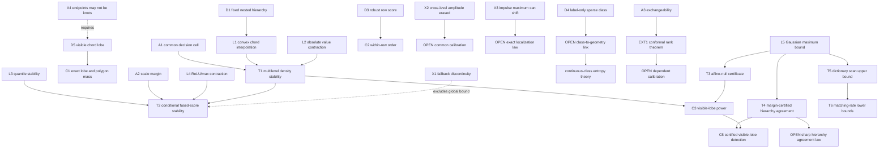

# HCRD transient detection: theorem DAG and falsification boundary

**Need.**  State the strongest claims that can currently be defended for the
multilevel area-density detector, and separate them from empirical or open
claims.  `OPEN` is not a theorem.  `OBS` is reproducible finite computation,
not a proof.

## Two different notions of the target class

The empirical class must be definable without looking at any detector score.
For a labelled series of length (n), let (R) be the longest contiguous
anomaly run and (M) the number of anomalous samples.  The preregistered WSD
class is

\[
    \mathcal C_{\rm label}(0.005,0.01)
    =\{(y,a):R/n\le 0.005,\ M/n\le0.01\}.
\]

This is an operational benchmark stratum, not a signal model and not a claim
that HCRD must win on every member.

The mechanistic class is conditional on geometry.  Let
(K_0\supset K_1\supset\cdots\supset K_L) be a fixed nested knot hierarchy,
(B_0=I), and let (B_j^K y) be the linear interpolant of the original
samples (y) on (K_j).  Write

\[
 D_j^K y=B_{j-1}^K y-B_j^K y,
 \qquad A_j^K(y)=|D_j^K y|.
\]

An interval (I=[k_r,k_{r+1}]) is an **HCRD-visible chord lobe** at level
(j) when the observed signal has the form (y=b+q) on (I), (b) is the
retained chord, (q) vanishes at the endpoint knots, has one sign in the
interior, and the HCRD decisions retain those endpoints at that level.  The
last condition is essential and prevents a circular promise that every short
event is visible.

## Normalized statements

1. **Fixed-hierarchy multilevel stability.**  If (y,z) induce the same
   nested knot hierarchy through level (L), then for every (j\le L)
   \[
   \|B_j^K y-B_j^K z\|_\infty\le\|y-z\|_\infty,
   \quad
   \|A_j^K(y)-A_j^K(z)\|_\infty\le2\|y-z\|_\infty.
   \]
2. **Conditional exact lobe recovery.**  On an HCRD-visible chord lobe the
   relevant detail equals (q), its density equals (|q|), and its integrated
   density equals the exact polygon area between the samples and the chord.
   A triangular lobe of base width (W) and height (H) therefore has mass
   (WH/2).
3. **Within-row order preservation.**  For a nondegenerate density row, the
   robust positive-surprise map is nondecreasing in the row value.  Thus it
   preserves within-level ranking, including ties.  It does **not** preserve
   amplitude ordering between different levels.
4. **Conditional normalizer stability.**  Let a density row (a) have median
   (m), 0.9-quantile (u), scale (s=u-m\ge s_0>0), and
   (B=\|a-m\|_\infty).  If (\|a-a'\|_\infty\le\delta\le s_0/4), then the
   positive 0.9-quantile branch remains active and
   \[
   \|S(a)-S(a')\|_\infty
   \le {4\delta\over s_0}+{4B\delta\over s_0^2}.
   \]
5. **Max-fusion stability inside a common decision cell.**  If the assumptions
   of statements 1 and 4 hold for every used level, the pointwise maximum over
   levels is Lipschitz with the largest of the row bounds.  No unconditional
   global bound follows because both the HCRD knot map and the fallback
   normalizer branch are discontinuous.
6. **Exchangeable calibration bridge (external).**  For any scalar HCRD
   nonconformity score and (m) exchangeable normal calibration scores,
   \[
   p={1+\#\{i:S_i\ge S_{m+1}\}\over m+1}
   \]
   is super-uniform.  This is a generic conformal result, not an HCRD novelty.
   Ordinary time-series dependence does not imply exchangeability, so a valid
   block/sequential calibration theorem remains `OPEN`.
7. **Certified common-scale affine-null detector.**  Suppose
   (y_i=\alpha+\beta x_i+e_i), the minimum spacing is (h_{\min}>0), and
   (e_i\stackrel{\rm iid}{\sim}N(0,\sigma^2)).  Set
   \[
   \varepsilon=\sigma\sqrt{2\log(2n/\delta)},\qquad
   \eta=4\varepsilon/h_{\min},\qquad \tau=\lambda\eta,
   \quad \lambda\ge1.
   \]
   Run HCRD with absolute curvature tolerance (\tau), no relative tolerance,
   and score
   \[
      Z(t)=\left[\max_j A_j(y)(t)-2\varepsilon\right]_+.
   \]
   Then (P\{Z(t)=0\ \text{for every }t\}\ge1-\delta).
8. **Conditional visible-lobe power.**  On the event
   (\|e\|_\infty\le\varepsilon), if the thresholded noisy and noiseless
   hierarchies share the relevant knots and a noiseless visible lobe has peak
   height (H), then its peak score is at least
   ([H-4\varepsilon]_+).  Hence (H>4\varepsilon) is a sufficient detection
   condition.  A sharp probability bound for hierarchy agreement remains
   `OPEN`.
9. **Finite-sample hierarchy-agreement certificate.**  Fix a noiseless signal,
   run the minimum-curvature hierarchy with tolerance (\tau), and expose the
   scalar decisions made by the knot walk through level (L).  At every level,
   suppose every curvature classified inactive obeys
   (|\kappa_i|+\eta\le\tau), every curvature classified active obeys
   (|\kappa_i|-\eta>\tau), and every comparison
   (|\kappa_i|<|\kappa_j|) actually used to select a side of an unsampled
   sign transition has magnitude gap
   (\big||\kappa_i|-|\kappa_j|\big|>2\eta).  Then on
   (\|e\|_\infty\le\varepsilon) the noisy and noiseless knot hierarchies agree
   through level (L).  Under iid Gaussian noise this event has probability at
   least (1-\delta).  The result is conservative but removes hierarchy
   agreement as an uncheckable premise for this explicit margin class.
10. **Certified visible-lobe detection.**  Under statement 9, a noiseless
    visible lobe of height (H>4\varepsilon) has a strictly positive noisy score
    at its noiseless peak with probability at least (1-\delta).  This is an
    upper detection guarantee, not a minimax boundary or an exact localisation
    theorem.
11. **Fixed-dictionary scan boundary.**  Let an independent guide (or the
    protocol) supply (M) oriented, unit-norm complete HCRD residual shapes
    (v_m\perp\operatorname{span}\{1,x\}).  The one-sided Gaussian scan has
    level at most (\alpha) at (\sqrt{2\log(M/\alpha)}) and power at least
    (1-\beta) for standardised lobe norm
    (\mu\ge\sqrt{2\log(M/\alpha)}+\sqrt{2\log(1/\beta)}).  If
    (\rho_m=\max_{k\ne m}\langle v_k,v_m\rangle), its maximiser localises (m)
    with probability (1-\delta) when
    (\mu(1-\rho_m)>2\sqrt{2\log(2M/\delta)}).
12. **Matching-rate impossibility.**  On an orthonormal (M)-template subclass,
    the uniform mixture has chi-squared divergence
    ((e^{\mu^2}-1)/M).  Total variation therefore rules out uniform
    level-(\alpha), power-(1-\beta) detection below the explicit finite-sample
    condition in the paper.  Fano's inequality gives mean localisation error
    at least (1-(\mu^2+\log 2)/\log M).  Detection and localisation therefore
    both require order (\sqrt{\log M}) signal norm.  This lower-bound subclass
    is deliberately not described as an orthogonality property of arbitrary
    HCRD lobes.

## Node table

| ID | Type | Content |
|---|---|---|
| D1 | DEF | Fixed nested knots (K_0\supset\cdots\supset K_L) |
| D2 | DEF | Baselines (B_j^K), details (D_j^K), densities (A_j^K) |
| D3 | DEF | Row score (S(a)=(a-\operatorname{med}a)_+/s(a)) with the implemented quantile/fallback scale |
| D4 | DEF | Label-only sparse-transient class (\mathcal C_{\rm label}) |
| D5 | DEF | HCRD-visible chord lobe |
| A1 | ASM | Both signals stay in the same nested HCRD decision cell through level (L) |
| A2 | ASM | Every used row has quantile scale at least (s_0>0) and perturbation at most (s_0/4) |
| A3 | ASM | Calibration scores are exchangeable under the null |
| L1 | LEM | A chord interpolant is a convex combination of two retained samples |
| L2 | LEM | Absolute value is 1-Lipschitz |
| L3 | LEM | Median and empirical quantiles are 1-Lipschitz in (\ell_\infty) |
| L4 | LEM | ReLU and pointwise maximum are 1-Lipschitz in (\ell_\infty) |
| T1 | THM | Fixed-hierarchy multilevel density stability |
| T2 | THM | Conditional normalizer and max-fusion stability |
| C1 | COR | Exact chord-lobe recovery and polygon mass |
| C2 | COR | Within-row order preservation |
| EXT1 | EXT | Finite-sample split-conformal rank validity under exchangeability |
| L5 | LEM | Gaussian maximum bound (P(\|e\|_\infty>\varepsilon)\le\delta) |
| T3 | THM | Family-wise affine-null certificate for common-scale score (Z) |
| T4 | THM | Hierarchy agreement under explicit threshold and transition-comparison margins |
| X1 | CTR | Sparse-row fallback normalizer is discontinuous and locally unbounded |
| X2 | CTR | Per-row scaling erases cross-level amplitude ordering |
| X3 | CTR | Pure impulse need not receive the pointwise maximum score at its own sample |
| X4 | CTR | A lobe need not be recovered unless its endpoints are retained knots |
| OBS1 | OBS | Exhaustive pure-impulse check for (4\le n\le180): any displaced maximum was adjacent, and the impulse rank was at most two |
| C3 | COR | Conditional visible-lobe peak lower bound ([H-4\varepsilon]_+) |
| C4 | COR | Exchangeable split-conformal calibration bridge |
| C5 | COR | Finite-sample visible-lobe detection under certified hierarchy margins |
| T5 | THM | Fixed/independent-guide lobe-dictionary scan and localisation upper bounds |
| T6 | THM | Chi-squared/Fano lower bounds on an orthonormal lobe subclass |
| O1 | OPEN | Prove or refute one-sample localization for a pure impulse for all (n) and all implemented levels |
| O2 | OPEN | Derive a noise-aware common cross-level calibration that retains affine/scale equivariance |
| O3 | OPEN | Relate observable label sparsity/duration to the HCRD-visible chord-lobe conditions under a stochastic background model |
| O4 | OPEN | Valid block or sequential conformal calibration for dependent HCRD score streams |
| O5 | RESOLVED-TRIANGULAR | Continuous compact class has Dudley--Borell level/power, identifiability localisation, sieve approximation, and packing lower boundary; an interior triangular family has an explicit residual/Lipschitz certificate |
| O6 | OPEN | Sharp or distribution-adaptive hierarchy-agreement probability beyond the conservative sup-norm margin certificate |

## Edge table

| From | Relation | To |
|---|---|---|
| D1, L1, A1 | imply baseline bound in | T1 |
| T1, L2 | imply density bound in | T1 |
| D5, D2 | imply | C1 |
| D3 | directly implies | C2 |
| L3, L4, A2 | imply row bound in | T2 |
| T2, L4 | imply max-fusion bound in | T2 |
| A3, EXT1 | imply exchangeable calibration bridge | C4 |
| L5, divided-curvature perturbation bound | imply | T3 |
| L5, divided-curvature perturbation bound, stable decision predicates | imply | T4 |
| T1, T3, D5 | imply | C3 |
| X1 | fails_without | A2 |
| X2 | blocks | unconditional cross-level amplitude ordering |
| X3 | blocks | exact pointwise impulse localization |
| X4 | fails_without | D5 endpoint-knot condition |
| D4 | defines without scores | WSD confirmatory stratum |
| D4, empirical results | inform but do not prove | O3 |
| X1, X2 | motivate | O2 |
| O3 | required by | population-level structural guarantee |
| O5 | generalizes | T5 from a finite dictionary to an entropy-controlled compact class |
| T1, T4, C3 | imply | C5 |
| O6 | required by | a sharp unconditional visible-lobe power claim |

## Mermaid DAG

## First use of hypotheses

- The common-decision-cell assumption is first used when the same knot indices
  are inserted into the two chord interpolants.  It cannot be removed because
  raw HCRD changes discontinuously at curvature-sign and centred-comparison
  boundaries.
- The positive scale margin is first used to prevent the 0.9-quantile branch
  from reaching zero.  `X1` shows that the implemented fallback is not a
  continuous extension at that boundary.
- The endpoint-knot condition is first used to identify the retained baseline
  with the claimed chord.  A signal being short, triangular, or visually
  convex does not imply this condition by itself.
- Exchangeability is first used in the uniform rank argument.  Stationarity,
  mixing, and weak dependence are not interchangeable with exchangeability.
- The supplied Gaussian-noise upper bound is first used to convert a desired
  family-wise error probability into the common input radius
  (\varepsilon).  A plug-in estimate does not inherit this guarantee.
- Minimum spacing is first used to turn the input-radius event into the common
  curvature perturbation radius (\eta=4\varepsilon/h_{\min}).
- The inactive, active, and magnitude-comparison margins are first used to
  keep every branch predicate of the minimum-curvature knot walk unchanged.
  Without the final comparison margin, two opposite active curvatures can keep
  their signs yet swap which side of the transition is retained.

## Proof skeletons

**T1.**  At any sample, (B_j^K y) is either a retained ordinate or a convex
combination of two retained ordinates.  Hence its change is at most
(\varepsilon=\|y-z\|_\infty).  The difference of two such baselines changes
by at most (2\varepsilon), and applying absolute value cannot enlarge the
pointwise difference.

**T2.**  By `L3`, the median and 0.9-quantile each move by at most (\delta),
so the quantile scale moves by at most (2\delta) and stays at least
(s_0/2).  The centred positive numerator moves by at most (2\delta).
For numerator magnitude bounded by (B+2\delta), the quotient difference is
at most

\[
 {2\delta\over s_0}
 +{4(B+2\delta)\delta\over s_0^2}
 \le {4\delta\over s_0}+{4B\delta\over s_0^2}.
\]

Take the largest row bound and apply pointwise-max contraction.  Composing with
T1 uses (\delta=2\|y-z\|_\infty) only when every row retains its margin.

**C1.**  With the lobe endpoints retained and (q=0) at them, the retained
linear interpolant is (b), so the detail is (q).  Exact piecewise-linear
integration of (|q|) is the polygon area.  The triangle formula is immediate.

**C2.**  Median subtraction, positive scaling, and ReLU are nondecreasing in a
coordinate while the row statistics are held fixed; therefore row order is
preserved.  Different rows have different statistics, so the conclusion does
not compare levels.

**T3.**  A union bound over the (n) Gaussian samples gives
(\|e\|_\infty\le\varepsilon) with probability at least (1-\delta).  On any
active grid, each noisy divided-slope error is at most
(2\varepsilon/h_{\min}), hence each curvature error is at most
(\eta\le\tau).
The affine signal has zero curvature, so the thresholded first HCRD level
retains only the endpoints.  Its noisy detail differs from zero by at most
(2\varepsilon), because both the sample and its endpoint chord move by at
most (\varepsilon).  The hierarchy then terminates and (Z\equiv0).

**C3.**  Under hierarchy agreement, T1 bounds the noisy density error by
(2\varepsilon).  At a noiseless lobe peak its density is (H), so the noisy
density is at least (H-2\varepsilon); subtracting the certified null radius
gives ([H-4\varepsilon]_+).

**T4.**  Conditional on (\|e\|_\infty\le\varepsilon), a divided slope on
any retained interval changes by at most (2\varepsilon/h_{\min}); hence a
difference of consecutive divided slopes changes by at most (\eta).  The
inactive and active inequalities preserve threshold status and sign.  Two
curvature magnitudes can each move by at most (\eta), so the (2\eta) gap
preserves every magnitude comparison used at an unsampled sign transition.
The complete branch trace of the first knot walk is therefore unchanged.
Induct on levels: identical knots expose the same retained locations at the
next level, where the same bounds and margins apply.  The Gaussian maximum
bound supplies probability at least (1-\delta).

**C5.**  T4 supplies the hierarchy agreement required by C3.  Therefore the
noisy score at the noiseless lobe peak is at least
([H-4\varepsilon]_+), which is positive when (H>4\varepsilon), on an event
of probability at least (1-\delta).

## Explicit counterexamples

**X1 — fallback discontinuity (`CTR`).**  For a row of length 20 let
(a_\epsilon) contain 18 zeros, one entry (\epsilon>0), and one entry 1.
NumPy's implemented linear 0.9-quantile is (0.1\epsilon), so the last score
is (10/\epsilon).  At (\epsilon=0), the quantile scale vanishes, the
fallback scale is 1, and the last score is 1.  Thus the current normalizer is
discontinuous and locally unbounded at a sparse-row boundary.

**X2 — cross-level amplitude erasure (`CTR`).**  Let two nonnegative rows have
the same shape (r), while the second is (\epsilon r).  Row-wise
normalization gives exactly the same surprise vector for all (\epsilon>0).
Consequently a vanishing-amplitude level can tie a large-amplitude level.  The
implemented `max` score is scale invariant, but it is not a cross-level energy
ranking or a statistical significance comparison.

**X3 — exact impulse location (`CTR`).**  With length (n=4), signal
((0,0,1,0)), eight-level maximum fusion (terminating early when appropriate),
the score at the impulse is (1.25), while the preceding sample scores
(10/7\approx1.4286).  The claim "a pure impulse always has its global score
maximum at the impulse sample" is false.

**X4 — shape is not enough (`CTR`).**  Add a short one-sign triangular bump to
a background whose discrete curvature does not produce its support endpoints
as retained knots.  The HCRD chord then spans different endpoints, so the
detail is not the proposed triangle.  The weakest repaired theorem is `C1`,
which explicitly assumes the retained endpoint knots.

## Open theoretical extensions

The existing deterministic geometry is enough to justify interpretability,
exact reconstruction, conditional lobe mass, and local stability.  T3 now
adds a conservative finite-sample affine-null guarantee without row-wise
normalisation.  T4 closes hierarchy agreement for an explicit deterministic
margin class, and the separate entropy proof DAG closes the generic continuous-
class bridge `O5`.  Open extensions are `O3`, which covers boundary-touching and
general polygonal templates, and the sharper part of `O6`: a non-affine
stochastic background and transient law under which the margins occur with
useful probability, followed by a sharp detection/localisation boundary. The
WSD experiment does not address these theorem extensions.

## Retrieval prompt

Reconstruct the argument proving fixed-hierarchy density stability, identify
the first use of the common-cell assumption, then give `X1` and explain why it
prevents an unconditional global stability theorem for the current fused
score.
